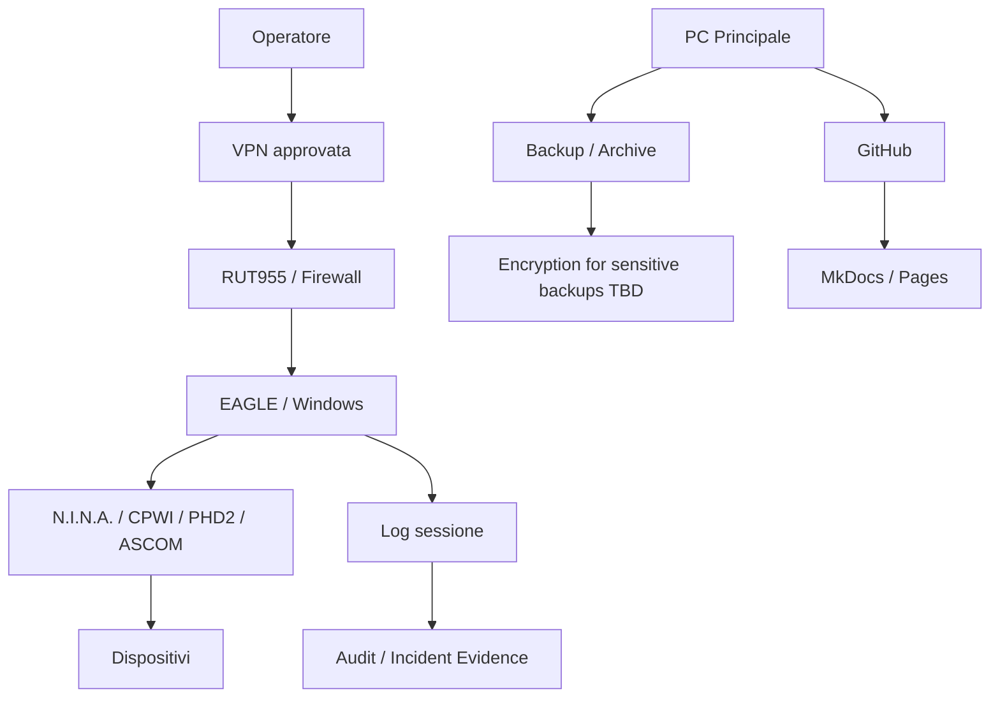

# DSG-EA-SA-001 - Security Architecture

| Campo | Valore |
|---|---|
| Layer | Security Architecture |
| Stato | Proposed refinement |
| Versione | 0.1 |
| Data | 2026-07-27 |
| Fonte gerarchica | `DSG-MR-001` |
| DSRA | `DSRA-000`, `DSRA-001` |

## Scopo

Descrivere la sicurezza architetturale Digital StarGate per accesso remoto, operazioni osservatorio, documentazione, dati, backup e recovery. Il documento non inventa policy: usa controlli presenti in manuali e governance e registra decisioni aperte dove mancano dettagli.

## Security Principles

| Principle | Applicazione | Traceability |
|---|---|---|
| Safety-first | Nessun componente AI/cloud/portale comanda funzioni safety | `DSRA-001`, Capitoli 16, 26 |
| VPN-first remote access | Accesso operativo attraverso VPN e canali approvati | Capitoli 5, 24 |
| Secrets out of repository | Password, token, chiavi VPN, certificati privati non sono pubblicati | Governance, Capitoli 5, 21 |
| Evidence-based audit | Accessi, release, incident e backup devono produrre evidenza | Governance, Capitoli 21, 30-31 |
| Unknown is unsafe | Dato meteo assente/incoerente blocca apertura o richiede stato conservativo | Capitolo 26 |

## Security Domains

| Domain | Description | Current evidence | Open decisions |
|---|---|---|---|
| Identity | Account operatori, GitHub, Windows/EAGLE, servizi esterni | Account nominativi non dettagliati; Massimo Mainini owner | Modello identity e revoca |
| Authentication | VPN, GitHub, Windows, router, cloud/API TBD | VPN richiesta; segreti fuori repository | MFA/certificati/rotation non documentati |
| Authorization | Accesso a repo, EAGLE, router, storage | GitHub permissions e ruoli governance | Matrice autorizzazioni dettagliata |
| VPN | Canale remoto verso osservatorio | RUT955, VPN, no port forwarding non necessario | Configurazione e certificati non pubblicabili |
| Secrets | Password, token, chiavi, certificati | Divieto repository | Vault/gestore segreti da decidere |
| Certificates | VPN/API/provider | Citati come sensibili | Inventory certificati e scadenze |
| Remote Operations | Desktop remoto verso EAGLE | Accesso via VPN, procedure avvio | Hardening e session recording TBD |
| Audit | GitHub history, log, incident report | Commit, review, log sessione | Audit accessi router/EAGLE TBD |
| Backup Encryption | Copie con credenziali/config sensibili cifrate | Capitolo 21 | Metodo cifratura e custodia chiavi |
| Recovery | Restore EAGLE, config, dati | Capitolo 21 | Test e RTO/RPO dati osservativi |
| Disaster Recovery | Strategia 3-2-1 | Capitolo 21 | Cloud/off-site provider e restore evidence |
| Operational Security | Meteo, safety, Park, chiusura | Capitoli 16,18,25,26 | Soglie finali meteo e sensori |

## Security Control View

## Remote Operations Security

| Control | Description | Roadmap | DSRA | ADR | SOP | Manual |
|---|---|---|---|---|---|---|
| VPN access | Accesso remoto deve passare da VPN o canale approvato | Security/Network | `DSRA-001` Network | OPEN | Capitolo 5 | Capitoli 5,24 |
| No secrets in repo | File `.key`, `.ovpn` con segreti, token e password esclusi | Governance | `DSRA-001` Documentation | `DSG-ADR-004` | Governance | Capitoli 5,21 |
| Safe weather decision | UNKNOWN/UNSAFE blocca apertura o impone chiusura | Operations/Security | `DSRA-001` Safety | OPEN | Capitolo 26 | Capitolo 26 |
| Human review for AI | AI non opera funzioni safety e output revisionabili | AI/Governance | `DSRA-000` AI TBD | OPEN | Governance | Governance AI |
| GitHub traceability | Modifiche documentali e release tracciate da commit/review | Documentation | `DSRA-001` Documentation | `DSG-ADR-004` | Release docs | Governance |
| Backup protection | Backup contenenti credenziali/config VPN cifrati | DR/Security | `DSRA-001` DR | OPEN | Capitolo 21 | Capitolo 21 |

## Authentication and Secrets

| Asset | Authentication known | Sensitive data handling | Decision status |
|---|---|---|---|
| RUT955/VPN | VPN/certificati o credenziali da validare | Non pubblicare export completi o chiavi | OPEN |
| EAGLE/Windows | Account Windows/desktop remoto | Password fuori repository | OPEN |
| GitHub | Account GitHub/token gestiti fuori repo | Token non pubblicati | AS-IS governance |
| Cloud Storage | TBD | Chiavi/API fuori repo, cifratura TBD | OPEN |
| OpenAI | API key TBD | Prompt sanitizzati, segreti fuori repo | OPEN |
| TNS/AAVSO/Astrometry.net | Account/API key TBD | Credenziali fuori repo | OPEN |

## Backup and Recovery Security

| Area | Control | Evidence | Open decision |
|---|---|---|---|
| Configurazioni operative | Backup con checksum e copia secondaria | Capitolo 21 | Metodo cifratura e custodia chiavi |
| Dati osservativi | Non eliminare locale prima verifica copia | Capitolo 28 | Retention e RTO/RPO dati |
| Router/VPN | Backup config protetto | Capitoli 5,21 | Export sanitizzato vs copia completa |
| Repository | GitHub come source of record | Governance/release docs | Policy recovery branch/permissions |

## Disaster Recovery Security

La DR deve evitare che un singolo errore o compromissione cancelli tutte le copie. Il principio 3-2-1 e documentato, ma provider off-site, cifratura, segregazione, restore evidence e custodia chiavi restano decisioni aperte.

## ArchiMate Motivation/Security Viewpoint

| ArchiMate concept | Digital StarGate element |
|---|---|
| Driver | Sicurezza operativa, protezione dati, accesso remoto governato |
| Requirement | VPN-first, no secrets in repo, unknown weather unsafe, backup protected |
| Constraint | Roadmap freeze, no AI safety autonomy, no sensitive configs in docs |
| Assessment | DSRA risk assessment, security chapters, backup/recovery tests |

## Open Architectural Decisions

Security open decisions are maintained in [Architecture Decision Catalog](architecture-decision-catalog.md#open-architectural-decisions): identity model, certificate inventory, secret vault, VPN auth details, backup encryption, cloud security, OpenAI data handling and external scientific submission credentials.