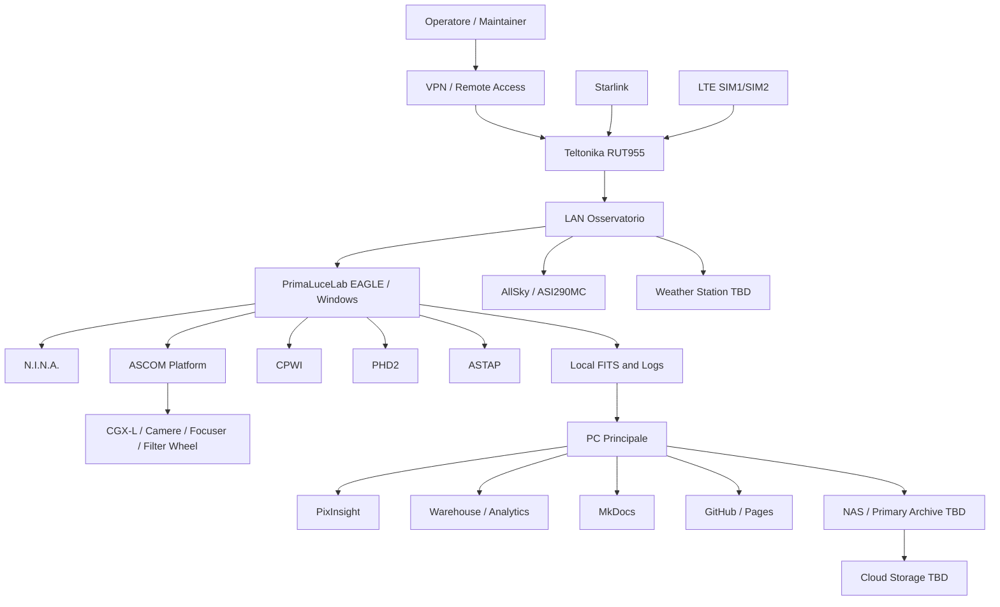
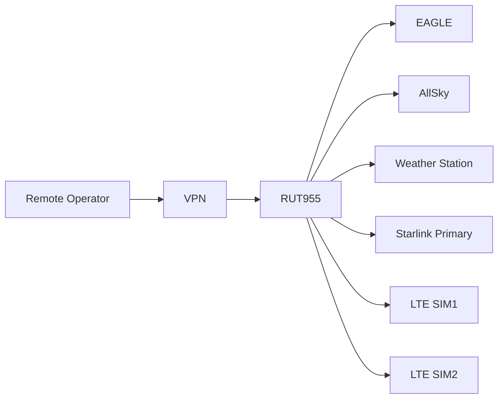

# DSG-EA-TA-001 - Technology Architecture

| Campo | Valore |
|---|---|
| Layer | Technology Architecture |
| Stato | Proposed refinement |
| Versione | 0.1 |
| Data | 2026-07-27 |
| Fonte gerarchica | `DSG-MR-001` |
| DSRA | `DSRA-000`, `DSRA-001` |

## Scopo

Descrivere il deployment fisico e tecnologico di Digital StarGate come piattaforma distribuita tra osservatorio remoto, EAGLE, PC Principale, GitHub, storage e servizi esterni governati.

## Deployment View

## Deployment Nodes

| Node | Execution Environment | Hardware / Technology | Responsibilities | Dependencies | Roadmap | DSRA | ADR | SOP | Manual |
|---|---|---|---|---|---|---|---|---|---|
| Observatory | Campo remoto | Cupola/tetto, montatura, ottiche, camere, sensori | Operazioni osservatorio e safety | Meteo, rete, alimentazione | Observatory/Operations | `DSRA-001` Observatory | `ADR-001` | Capitoli 16,25,26 | Capitoli 3-10 |
| EAGLE | Windows | PrimaLuceLab EAGLE | Controllo strumenti, acquisizione, log, storage locale | RUT955, USB, software astronomico | Operations/Data | `DSRA-001` EAGLE | `ADR-001` | Capitolo 16 | Capitolo 6 |
| N.I.N.A. | Windows app | N.I.N.A. | Sequencer, acquisizione, autofocus, solve, meridian flip | ASCOM, PHD2, ASTAP, camere | Automation | `DSRA-001` Automation | `ADR-001` | Capitolo 17 | Capitolo 11 |
| ASCOM | Windows middleware | ASCOM Platform | Driver e interfacce device | CPWI, driver camere/focuser/filter wheel | Automation | `DSRA-001` | OPEN Alpaca | Capitolo 14 | Capitolo 14 |
| CPWI | Windows app | Celestron CPWI | Controllo diretto CGX-L | ASCOM, USB mount | Observatory | `DSRA-001` | `ADR-001` | Capitolo 13 | Capitoli 7,13 |
| PHD2 | Windows app | PHD2 | Guida, dither, RMS | ASCOM, camera guida, CPWI | Automation | `DSRA-001` | `ADR-001` | Capitolo 12 | Capitolo 12 |
| ASTAP | Windows app/db | ASTAP + database stellare | Plate solving locale | N.I.N.A. | Automation | `DSRA-001` | OPEN | Capitolo 17 | Capitolo 11 |
| PixInsight | PC Principale/workstation | PixInsight | Processing immagini | Data archive, calibration library | Data/Analytics | `DSRA-000` Data | OPEN | Capitolo 28 | Capitolo 28 |
| AllSky | Raspberry/equivalente | AllSky + ASI290MC | Verifica visuale cielo e timelapse | LAN, storage | Observatory | `DSRA-001` | OPEN | Capitolo 26 | Capitolo 27 |
| Weather Station | TBD | Sensori meteo | SAFE/WARNING/UNSAFE/UNKNOWN | Automation, Observatory | Security/Operations | `DSRA-001` Safety | OPEN | Capitolo 26 | Capitolo 26 |
| PC Principale | Engineering workstation | Git, MkDocs, analytics, processing | Documentazione, processing, analytics, release | GitHub, storage | Documentation/Analytics | `DSRA-001` PC Principale | `DSG-ADR-004`, `ADR-002`, `ADR-003` | Release docs | Developer/Analytics |
| NAS / Primary Archive | Storage locale TBD | NAS/storage TBD | Archivio primario e dataset | PC, EAGLE sync | DR/Data | `DSRA-001` | OPEN | Capitolo 21 | Capitoli 21,28 |
| Cloud Storage | Cloud TBD | Provider TBD | Copia off-site | Backup, security | DR/Data | `DSRA-001` | OPEN | Capitolo 21 | Capitolo 21 |
| GitHub | SaaS | Repository, Pages, Issues | Source of record, publication, review | PC Principale, MkDocs | Documentation | `DSRA-000` Web Portal | `DSG-ADR-004` | Release docs | Governance |
| Teltonika | Router/VPN | RUT955 | VPN, firewall, failover, LAN | Starlink, LTE, EAGLE | Network/Security | `DSRA-001` Network | OPEN | Capitolo 5 | Capitoli 5,24 |
| Internet Connectivity | WAN | Starlink, LTE SIM1/SIM2 | Accesso remoto e sync | RUT955 | Network | `DSRA-001` | OPEN | Capitolo 5 | Capitolo 5 |

## Security Zones

| Zone | Scope | Controls documented | Unknowns |
|---|---|---|---|
| Observatory LAN | EAGLE, AllSky, weather, devices | RUT955, VPN, no public secrets | IP plan, full device list |
| Remote Access Zone | VPN, desktop remoto | VPN required, credentials outside repo | Auth model and revocation details |
| Engineering Zone | PC Principale, Git, MkDocs, PixInsight | GitHub review, no secrets | Local hardening baseline |
| Publication Zone | GitHub Pages / static portal | Static publication, release review | Public/private exposure policy |
| Backup Zone | NAS/cloud/off-site | 3-2-1 principle, restore tests | Provider and encryption details |

## Network Dependencies

## Backup and Recovery

| Item | Backup requirement | Recovery reference |
|---|---|---|
| Repository and documentation | GitHub source and release evidence | `docs/chapters/21-backup-disaster-recovery.md` |
| EAGLE configuration | Windows, N.I.N.A., CPWI, PHD2, ASCOM profiles | Capitolo 21 recovery EAGLE |
| Astronomical data | FITS, calibration library, processed images, reports | Capitoli 21 and 28 |
| RUT955 configuration | Sanitized backup, sensitive copy protected | Capitoli 5 and 21 |
| Analytics/warehouse | Dataset and schema evidence | ADR-002, ADR-003, warehouse docs |

## Monitoring and Health Checks

| Area | Health evidence | Source |
|---|---|---|
| EAGLE | CPU/RAM/disk, device manager, Windows time | Capitolo 16 |
| Network | VPN, RUT955, Starlink, failover, latency | Capitolo 5 |
| Weather safety | SAFE/WARNING/UNSAFE/UNKNOWN, freshness | Capitolo 26 |
| Acquisition | N.I.N.A./PHD2/CPWI/ASCOM logs | Capitoli 11-14,17 |
| Storage | free space, file counts, hash/checksum | Capitoli 21,28 |
| Publication | MkDocs build, navigation, links | Release documentation |

## ArchiMate Technology Viewpoint

| ArchiMate concept | Digital StarGate element |
|---|---|
| Node | EAGLE, PC Principale, RUT955, GitHub, NAS, Cloud Storage |
| Device | CGX-L, cameras, focusers, AllSky, Weather Station |
| System Software | Windows, ASCOM, N.I.N.A., CPWI, PHD2, ASTAP, MkDocs |
| Communication Network | Observatory LAN, VPN, Starlink, LTE failover |
| Artifact | FITS, logs, Markdown docs, dashboard static files |

## Open Architectural Decisions

Open technology decisions are maintained in [Architecture Decision Catalog](architecture-decision-catalog.md#open-architectural-decisions), including NAS/cloud storage, weather station, ASCOM Alpaca, telemetry contracts, security zones and backup encryption details.