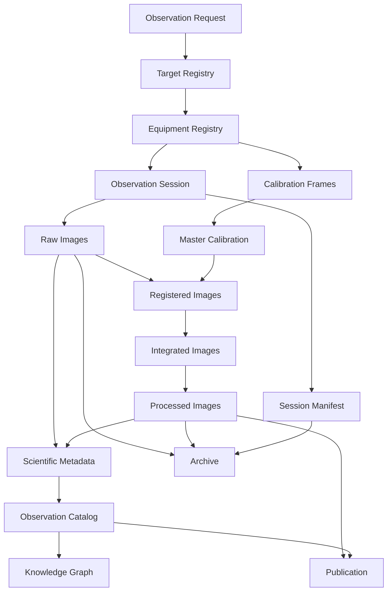

# DSG-ESB-006 - Astronomical Data Architecture

| Campo | Valore |
|---|---|
| Documento | Astronomical Data Architecture |
| Identificativo | `DSG-ESB-006` |
| Stato | Proposed architecture baseline |
| Versione | 0.1 |
| Data | 2026-07-27 |
| Roadmap | `DSG-MR-001` |
| Documento padre | [DSG-ESB-001](index.md) |

## Scopo

Descrivere il ciclo di vita completo dei dati astronomici Digital StarGate, dalla richiesta osservativa alla pubblicazione e archiviazione. La fonte primaria e la documentazione esistente su N.I.N.A., acquisizione automatica, camere, calibrazione, gestione dati, warehouse, analytics e backup.

## Ciclo di vita dati



## Stati del dataset osservativo

| Stato | Significato | Criterio di ingresso | Criterio di uscita |
|---|---|---|---|
| `REQUESTED` | Target o sessione candidata | Observation Request registrata | Session plan approvato o scartato |
| `PLANNED` | Sessione pianificata | Target, profilo e finestra definiti | Readiness superata |
| `ACQUIRED` | Dati raw prodotti | FITS e log presenti su EAGLE | Verifica integrita completata |
| `CALIBRATED` | Dati calibrati | Calibration/master validi | Registrazione completata |
| `REGISTERED` | Frame allineati | Registrazione completata | Integrazione completata |
| `INTEGRATED` | Stack integrato | Integrazione completata | Processing finale completato |
| `PROCESSED` | Immagine elaborata | Export e log processing disponibili | Metadata/catalogo aggiornati |
| `CATALOGED` | Dataset nel catalogo | Observation Catalog aggiornato | Pubblicazione o archiviazione |
| `PUBLISHED` | Asset pubblicabile | Review e metadati minimi presenti | Release/content update |
| `ARCHIVED` | Dataset conservato | Copie e verifica integrita completate | Restore test secondo policy |

## Dataset catalog

| Dataset | Owner | Producer | Consumer | Retention | Storage | Related SOP | Related ADR |
|---|---|---|---|---|---|---|---|
| Observation Request | Operations Owner | Scheduler / operatore | Scheduler, Observation Session | Permanente se osservata; altrimenti da definire | Documentation Platform o Target Registry | `docs/chapters/17-acquisizione-automatica.md` | TBD |
| Target Registry | Science/Operations Owner | Operatore / planner | Scheduler, Science Portal, Knowledge Graph | Permanente con versioni | Registry documentale o catalogo dati | `docs/chapters/17-acquisizione-automatica.md` | TBD |
| Equipment Registry | Engineering Owner | Maintainer tecnico | Scheduler, Calibration, Session Manager | Permanente | Documentazione/registri, asset management | `docs/chapters/22-inventario-asset-management.md` | TBD |
| Observation Session | Operations Owner | EAGLE / operatore | Data Platform, Analytics, Maintenance Portal | Permanente come report | Session reports, repository documentale | `docs/chapters/16-sop-avvio.md`, `docs/chapters/17-acquisizione-automatica.md` | `ADR-001` per session layer se applicabile |
| Session Manifest | Data Owner | Session Manager / chiusura dati | Data Platform, Archive, Analytics, KG | Permanente | Cartella sessione + catalogo | `docs/chapters/28-gestione-dati-archiviazione.md` | TBD |
| Raw Images | Data Owner | N.I.N.A. / camere | Calibration, Processing, Archive | Lungo termine per frame selezionati; secondo progetto | EAGLE acquisition workspace, primary archive, backup | `docs/chapters/17-acquisizione-automatica.md`, `docs/chapters/28-gestione-dati-archiviazione.md` | TBD |
| Calibration Frames | Imaging Owner | N.I.N.A. / camera / flat panel | Master Calibration, Processing | Finche validi per camera/configurazione | Calibration library | `docs/chapters/10-camere-treno-ottico.md`, `docs/chapters/28-gestione-dati-archiviazione.md` | TBD |
| Master Calibration | Imaging Owner | PixInsight / processing workflow | Registered Images, Processing | Fino a sostituzione e validazione | Processing workspace + archive | `docs/chapters/28-gestione-dati-archiviazione.md` | TBD |
| Registered Images | Imaging Owner | PixInsight / registration | Integrated Images, Quality Evaluation | Secondo progetto e spazio | Processing workspace | `docs/chapters/28-gestione-dati-archiviazione.md` | TBD |
| Integrated Images | Imaging Owner | PixInsight / integration | Processed Images, Science Portal | Secondo progetto; finali permanenti | Processing workspace + archive | `docs/chapters/28-gestione-dati-archiviazione.md` | TBD |
| Processed Images | Science/Imaging Owner | PixInsight / post-processing | Science Portal, Publication, Archive | Permanente per prodotti finali | Processed repository, exports, archive | `docs/chapters/28-gestione-dati-archiviazione.md` | TBD |
| Scientific Metadata | Data Owner | FITS headers, session report, processing report | Observation Catalog, KG, Analytics | Permanente con catalogo | Catalogo dati / warehouse | `docs/chapters/28-gestione-dati-archiviazione.md` | `ADR-003` per warehouse engine |
| Observation Catalog | Data Owner | Data Platform | Analytics, KG, Science Portal, Archive | Permanente | Warehouse/catalogo curato | `docs/chapters/28-gestione-dati-archiviazione.md` | `ADR-003` |
| Knowledge Graph | Architecture/Knowledge Owner | Traceability mapper da docs/catalogo | AI Assistant, Engineering Portal | TBD, almeno versionato | Storage graph TBD o registry documentale | `docs/enterprise/knowledge-index.md` | TBD |
| Publication | Documentation/Science Owner | Science Portal / MkDocs | Utenti, community, release evidence | Permanente per release | GitHub/MkDocs/GitHub Pages | `docs/enterprise/release-documentation.md` | `DSG-ADR-004` |
| Archive | Data/Infrastructure Owner | Backup & Recovery process | Restore, audit, reprocessing | Secondo classe dati; finali permanenti | Primary archive + secondary/off-site copy | `docs/chapters/21-backup-disaster-recovery.md` | TBD |

## Dettaglio dei dataset principali

### Observation Request

Richiesta logica di osservazione. Deve contenere almeno target, obiettivo, configurazione desiderata, vincoli temporali e note scientifiche o fotografiche. La forma definitiva del record non e ancora approvata.

### Target Registry

Registro dei target candidati o osservati. Deve collegare nome target, coordinate, periodo osservabile, configurazione C8/Quattro preferita, filtri, priorita e relazione con sessioni completate.

### Equipment Registry

Registro degli asset e delle configurazioni: CGX-L, C8 XLT, Quattro 200P, QHY695A, ToupTek 294MC Pro, camere guida, filtri, fuocheggiatori Pegasus FocusCube/ESATTO 2, Wanderer Cover V4, EAGLE e mapping USB/alimentazione.

### Observation Session e Session Manifest

La sessione e l'unita di tracciabilita. Il manifest deve collegare piano, profilo N.I.N.A., meteo, stato dispositivi, file prodotti, log, errori, controlli integrita e stato archiviazione. La struttura formale del manifest e una decisione aperta.

### Raw Images

File FITS prodotti dall'acquisizione. Devono mantenere naming coerente, header, categoria frame, target, camera, filtro, esposizione, binning, temperatura e progressivo. Non devono essere eliminati prima della verifica della copia primaria e secondaria.

### Calibration Frames e Master Calibration

Comprendono dark, flat, bias e dark-flat, piu i master derivati. La validita dipende da camera, gain/offset, binning, temperatura, filtro, rotazione, polvere e treno ottico.

### Registered, Integrated e Processed Images

Rappresentano le fasi di elaborazione successive: allineamento, integrazione e post-processing. Devono conservare log o note di processo sufficienti a ricostruire origine, strumenti e principali parametri.

### Scientific Metadata e Observation Catalog

I metadati scientifici devono collegare target, coordinate, data osservativa, camera, ottica, filtri, esposizione, qualita, processing status e riferimenti ai file. Il catalogo alimenta analytics, Knowledge Graph, portali e archiviazione.

### Knowledge Graph

Il Knowledge Graph non e ancora una piattaforma implementata. La sua architettura dati deve essere definita collegando entita reali: asset, sessioni, target, file, calibration library, documenti, ADR, rischi e controlli.

### Publication e Archive

La pubblicazione avviene solo dopo validazione di immagine, metadata e stato documentale. L'archivio conserva raw, processed, report, manifest e prove di integrita secondo policy backup/DR.

## Regole di qualita dati

| ID | Regola | Applicazione |
|---|---|---|
| `DSG-DATA-ARCH-001` | Nessun raw cancellato senza verifica copia | Chiusura dati di sessione |
| `DSG-DATA-ARCH-002` | Ogni file pubblicabile deve avere sessione e target | Science Portal / Publication |
| `DSG-DATA-ARCH-003` | Calibrazioni riusabili solo se compatibili | Calibration library |
| `DSG-DATA-ARCH-004` | Log e report seguono la retention dei dati correlati | Observation Session / Archive |
| `DSG-DATA-ARCH-005` | Dataset usati da analytics devono indicare fonte e stato qualita | Warehouse / Dashboard |
| `DSG-DATA-ARCH-006` | Informazioni mancanti non si inventano | Open Architectural Decisions |

## Storage model logico

```text
observations/
  YYYY/
    YYYY-MM-DD_TARGET/
      raw/
        light/
        dark/
        flat/
        bias/
      logs/
      reports/
      processed/
      exports/
      manifest/

calibration-library/
  CAMERA/
    BIN_GAIN_OFFSET_TEMP/
      dark/
      flat/
      bias/
      master/

catalog/
  targets/
  sessions/
  equipment/
  observations/
  publications/
```

La struttura e coerente con il capitolo gestione dati; eventuali variazioni operative devono essere registrate come decisione aperta o ADR.

## Open Architectural Decisions collegate

- Schema formale di Observation Request e Target Registry.
- Schema Session Manifest.
- Storage definitivo del catalogo osservativo.
- Relazione tra warehouse analytics e catalogo scientifico.
- Policy retention dettagliata per raw non selezionati, intermedi e prodotti finali.
- Modello dati Knowledge Graph.
