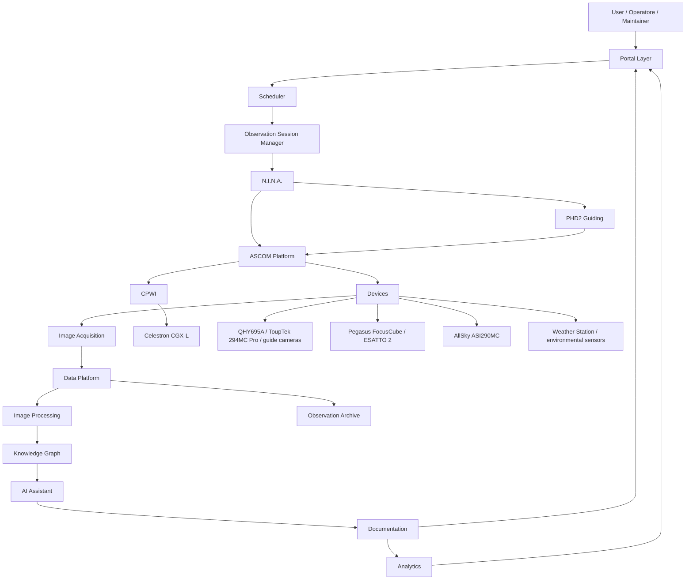
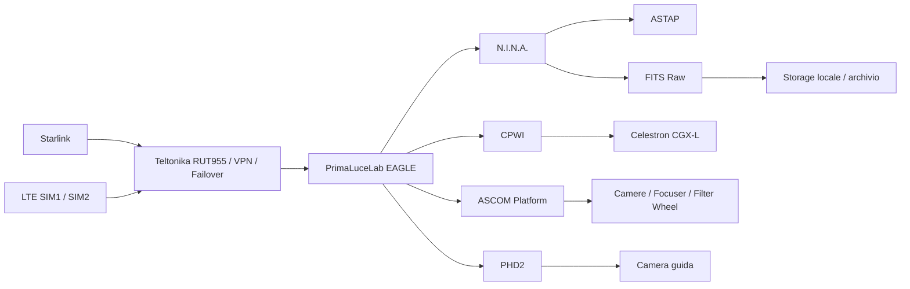
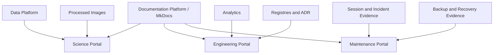

# DSG-ESB-005 - Logical Architecture

| Campo | Valore |
|---|---|
| Documento | Logical Architecture |
| Identificativo | `DSG-ESB-005` |
| Stato | Proposed architecture baseline |
| Versione | 0.1 |
| Data | 2026-07-27 |
| Roadmap | `DSG-MR-001` |
| Documento padre | [DSG-ESB-001](index.md) |

## Scopo

Questo documento descrive la Functional Architecture reale di Digital StarGate come piattaforma per osservatorio astronomico automatizzato. I domini sono derivati dalla documentazione esistente su osservatorio, EAGLE, montatura CGX-L, ottiche C8 XLT e Quattro 200P, camere, N.I.N.A., CPWI, PHD2, ASCOM, ASTAP, AllSky, meteo, gestione dati, analytics, backup e pubblicazione MkDocs.

Non introduce prodotti o tecnologie operative non gia presenti o non gia citate nel repository. Le informazioni mancanti sono registrate in [Open Architectural Decisions](open-decisions.md).

## Vista logica end-to-end

Il diagramma rappresenta dipendenze logiche. Non rappresenta un flusso di chiamate API implementato.

## Dipendenze operative reali

## Functional Architecture Domains

### Observatory

| Aspetto | Descrizione |
|---|---|
| Purpose | Governare lo stato fisico dell'osservatorio remoto e la possibilita di aprire, osservare e chiudere in sicurezza. |
| Responsibilities | Stato copertura/cupola, stato meteo SAFE/WARNING/UNSAFE/UNKNOWN, disponibilita rete, alimentazione, EAGLE, montatura in Park/Ready/Tracking, evidenze operative. |
| Inputs | Stato rete RUT955/Starlink/VPN, stato EAGLE, dati meteo, immagine AllSky, stato montatura, checklist avvio/chiusura. |
| Outputs | Stato osservatorio, autorizzazione o blocco apertura, readiness sessione, evidenze incident/recovery. |
| Dependencies | Network, EAGLE, Weather Station, AllSky, CGX-L, capitoli SOP avvio/acquisizione/recovery. |
| External integrations | Teltonika RUT955, Starlink, Weather Station, AllSky, desktop remoto approvato. |
| Related documentation | `docs/chapters/05-infrastruttura-rete.md`, `docs/chapters/06-eagle.md`, `docs/chapters/16-sop-avvio.md`, `docs/chapters/26-monitoraggio-meteo-sicurezza-ambientale.md`. |

### Automation

| Aspetto | Descrizione |
|---|---|
| Purpose | Rendere ripetibili avvio, sequenza osservativa, acquisizione automatica, meridian flip, recovery e chiusura dati. |
| Responsibilities | Sequenze N.I.N.A., ordine CPWI/ASCOM/N.I.N.A./PHD2, controlli pre-sessione, gestione anomalie, sincronizzazione e report. |
| Inputs | Profilo acquisizione, target, stato meteo, stato dispositivi, configurazione ottica, spazio disco, SOP. |
| Outputs | Sessione pronta, esposizioni eseguite, log applicativi, report sessione, stato archiviazione. |
| Dependencies | Observatory, Equipment, Observation Session, Imaging, Data Platform. |
| External integrations | N.I.N.A., CPWI, ASCOM, PHD2, ASTAP. |
| Related documentation | `docs/chapters/15-automazione.md`, `docs/chapters/16-sop-avvio.md`, `docs/chapters/17-acquisizione-automatica.md`, `docs/chapters/18-emergenze-recovery.md`. |

### Equipment

| Aspetto | Descrizione |
|---|---|
| Purpose | Rappresentare gli asset astronomici installati e le configurazioni riproducibili del treno ottico. |
| Responsibilities | Inventario CGX-L, C8 XLT, Quattro 200P, QHY695A, ToupTek 294MC Pro, camere guida, filtri, fuocheggiatori, flat panel, USB e alimentazioni. |
| Inputs | Registro asset, configurazioni ottiche, versioni driver, mapping USB, profili N.I.N.A./PHD2. |
| Outputs | Configurazioni standard, vincoli meccanici, compatibilita profili, dati da validare. |
| Dependencies | EAGLE, ASCOM, CPWI, PHD2, N.I.N.A., backup configurazioni. |
| External integrations | Driver vendor, ASCOM, CPWI, PHD2, N.I.N.A. |
| Related documentation | `docs/chapters/07-cgx-l.md`, `docs/chapters/08-c8-xlt.md`, `docs/chapters/09-quattro-200p.md`, `docs/chapters/10-camere-treno-ottico.md`, `docs/chapters/22-inventario-asset-management.md`. |

### Observation Session

| Aspetto | Descrizione |
|---|---|
| Purpose | Gestire la singola sessione osservativa come unita tracciabile di operazione, dati e qualita. |
| Responsibilities | Readiness, target, profilo, sequenza, log, eventi, frame acquisiti, anomalie, chiusura e stato `ARCHIVED`. |
| Inputs | Observation Request, target, meteo, profilo strumentale, sequenza, checklist. |
| Outputs | Session Manifest, FITS raw, log, report, metriche guida/fuoco, stato archiviazione. |
| Dependencies | Scheduling, Automation, Imaging, Data Platform, Logging di sessione. |
| External integrations | N.I.N.A., PHD2, CPWI, ASCOM, ASTAP. |
| Related documentation | `docs/chapters/16-sop-avvio.md`, `docs/chapters/17-acquisizione-automatica.md`, `docs/chapters/28-gestione-dati-archiviazione.md`, `docs/session-reports/index.md`. |

### Scheduling

| Aspetto | Descrizione |
|---|---|
| Purpose | Preparare piani osservativi basati su target, finestra temporale, meteo, Luna, configurazione ottica e readiness. |
| Responsibilities | Target Registry, priorita, vincoli di visibilita, profilo suggerito, finestre osservative, preparazione sequenza. |
| Inputs | Target candidate, configurazione C8/Quattro, disponibilita filtri/camera, meteo, calendario, stato osservatorio. |
| Outputs | Observation Request, Session Plan, requisiti calibrazione, note operative. |
| Dependencies | Observatory, Equipment, Calibration, Weather, Observation Session. |
| External integrations | N.I.N.A. planning/sequencer, cataloghi scientifici esterni solo se approvati. |
| Related documentation | `docs/chapters/17-acquisizione-automatica.md`, `docs/chapters/33-roadmap-evolutiva.md`, `docs/enterprise-solution-blueprint/open-decisions.md`. |

### Calibration

| Aspetto | Descrizione |
|---|---|
| Purpose | Assicurare frame di calibrazione coerenti con camera, temperatura, binning, gain/offset, filtro e treno ottico. |
| Responsibilities | Dark, flat, bias, dark-flat, master calibration, validita librerie, flat panel, offset fuoco per filtro. |
| Inputs | Configurazione ottica, camera, setpoint, filtri, data, profilo acquisizione. |
| Outputs | Calibration Frames, Master Calibration, stato validita calibrazione, note di riacquisizione. |
| Dependencies | Equipment, Imaging, Image Processing, Data Platform. |
| External integrations | N.I.N.A., camere QHY/ToupTek, ruota filtri, Wanderer Cover V4, PixInsight. |
| Related documentation | `docs/chapters/10-camere-treno-ottico.md`, `docs/chapters/17-acquisizione-automatica.md`, `docs/chapters/28-gestione-dati-archiviazione.md`. |

### Imaging

| Aspetto | Descrizione |
|---|---|
| Purpose | Acquisire immagini astronomiche grezze e metadati tecnici durante la sessione. |
| Responsibilities | Esposizioni light, naming FITS, header, raffreddamento, filtro, binning, dithering, autofocus, meridian flip. |
| Inputs | Session Plan, profilo N.I.N.A., stato dispositivi, guida PHD2, solve ASTAP. |
| Outputs | Raw Images, log acquisizione, metriche tecniche, eventi di errore. |
| Dependencies | Automation, Equipment, Calibration, Observation Session. |
| External integrations | N.I.N.A., ASCOM, PHD2, CPWI, ASTAP, camere, fuocheggiatori, filtri. |
| Related documentation | `docs/chapters/11-nina.md`, `docs/chapters/12-phd2.md`, `docs/chapters/13-cpwi.md`, `docs/chapters/14-ascom.md`, `docs/chapters/17-acquisizione-automatica.md`. |

### Image Processing

| Aspetto | Descrizione |
|---|---|
| Purpose | Trasformare dati raw e calibrazioni in prodotti registrati, integrati, elaborati e pubblicabili. |
| Responsibilities | Calibrazione, registrazione, integrazione, quality measurement, export, processing log. |
| Inputs | Raw Images, Calibration Frames, Master Calibration, metadata sessione. |
| Outputs | Registered Images, Integrated Images, Processed Images, metriche qualita, immagini pubblicabili. |
| Dependencies | Data Platform, Observation Archive, Analytics, Science Portal. |
| External integrations | PixInsight, ASTAP, eventuale Astrometry.net se approvato. |
| Related documentation | `docs/chapters/28-gestione-dati-archiviazione.md`, `docs/architecture/warehouse/index.md`, `docs/architecture/ADR-002-Analytics-Quality-Gates.md`. |

### Data Platform

| Aspetto | Descrizione |
|---|---|
| Purpose | Gestire il ciclo di vita dei dati astronomici, dai FITS raw al catalogo osservativo e warehouse analytics. |
| Responsibilities | Naming, cartelle, manifest, hash, integrita, lineage, catalogo, dataset analytics, retention. |
| Inputs | FITS raw, log, report sessione, processing output, metadata scientifici. |
| Outputs | Observation Catalog, dataset curati, warehouse, evidenze qualita, record archivio. |
| Dependencies | Imaging, Image Processing, Observation Archive, Analytics, Backup. |
| External integrations | Storage locale/remoto, GitHub per metadata documentali, cloud storage se approvato. |
| Related documentation | `docs/chapters/28-gestione-dati-archiviazione.md`, `docs/architecture/ADR-003-Warehouse-Engine.md`, `docs/architecture/warehouse/datasets-and-schema.md`. |

### Observation Archive

| Aspetto | Descrizione |
|---|---|
| Purpose | Conservare raw, processed, report, calibrazioni e manifest in modo recuperabile. |
| Responsibilities | Archive state, copie, retention, restore evidence, separazione raw/processed/export. |
| Inputs | Dataset validati, manifest, report, hash, classificazione dati. |
| Outputs | Dataset archiviati, restore evidence, stato retention, segnalazioni spazio. |
| Dependencies | Data Platform, Backup & Disaster Recovery, Storage. |
| External integrations | Storage locale, supporti secondari, cloud storage TBD. |
| Related documentation | `docs/chapters/21-backup-disaster-recovery.md`, `docs/chapters/28-gestione-dati-archiviazione.md`. |

### Knowledge Graph

| Aspetto | Descrizione |
|---|---|
| Purpose | Collegare semanticamente osservazioni, asset, configurazioni, documenti, ADR, rischi, controlli e dataset. |
| Responsibilities | Relazioni target-sessione-strumento-dataset-documento, provenance, impatto modifiche, retrieval controllato. |
| Inputs | Registri, catalogo osservazioni, metadata, documentazione MkDocs, ADR, DSRA. |
| Outputs | Mapping semantici, risposte interrogabili, contesto per AI Assistant. |
| Dependencies | Data Platform, Documentation Platform, Component Registry, Open Decisions. |
| External integrations | Nessuna integrazione obbligatoria approvata; storage graph da decidere. |
| Related documentation | `docs/enterprise-architecture/DSRA-000-vision-target-architecture.md`, `docs/enterprise-architecture/DSRA-001-reference-architecture.md`, `docs/enterprise/knowledge-index.md`, `docs/enterprise-solution-blueprint/open-decisions.md`. |

### AI Assistant

| Aspetto | Descrizione |
|---|---|
| Purpose | Supportare analisi documentale, sintesi, troubleshooting e interpretazione dati non safety con revisione umana. |
| Responsibilities | Retrieval da fonti approvate, risposta con riferimenti, audit prompt/output, nessun comando autonomo su safety. |
| Inputs | Domande, report sessione, log sanitizzati, Knowledge Graph, documenti approvati. |
| Outputs | Sintesi, ipotesi, checklist, commenti architetturali, elementi da verificare. |
| Dependencies | Knowledge Graph, Documentation Platform, Data Platform, Governance AI. |
| External integrations | OpenAI, solo dopo definizione di use case, retention, sanitizzazione e audit. |
| Related documentation | `docs/enterprise/governance.md`, `docs/enterprise-solution-blueprint/open-decisions.md`. |

### Documentation Platform

| Aspetto | Descrizione |
|---|---|
| Purpose | Mantenere il manuale Digital StarGate come fonte versionata di conoscenza, procedure, registri e architettura. |
| Responsibilities | MkDocs, capitoli tecnici, roadmap, ADR, SOP, registri, release evidence, navigazione. |
| Inputs | Modifiche documentali, evidenze operative, decisioni approvate, registri. |
| Outputs | Sito documentale, pagine enterprise, release notes, knowledge index. |
| Dependencies | GitHub, Governance, Analytics, Portali. |
| External integrations | GitHub, MkDocs Material, GitHub Pages. |
| Related documentation | `mkdocs.yml`, `docs/enterprise/handbook.md`, `docs/enterprise/release-documentation.md`, `docs/enterprise/adr/index.md`. |

### Analytics

| Aspetto | Descrizione |
|---|---|
| Purpose | Produrre KPI e viste operative su qualita dati, sessioni, warehouse e stato piattaforma. |
| Responsibilities | Dataset analytics, quality gates, dashboard, validation history, trend, reportistica. |
| Inputs | Observation Catalog, session report, warehouse, log aggregati, metriche imaging. |
| Outputs | Dashboard, KPI, report, esiti quality gate. |
| Dependencies | Data Platform, Documentation Platform, Science/Engineering Portal. |
| External integrations | GitHub Pages/MkDocs, warehouse engine documentato. |
| Related documentation | `docs/analytics/index.md`, `docs/analytics/dashboard-integrated.md`, `docs/architecture/ADR-002-Analytics-Quality-Gates.md`, `docs/architecture/ADR-003-Warehouse-Engine.md`. |

### Science Portal

| Aspetto | Descrizione |
|---|---|
| Purpose | Pubblicare risultati osservativi, immagini finali, cataloghi e contenuti scientifici validati. |
| Responsibilities | Presentazione osservazioni, immagini elaborate, metadati scientifici, link a cataloghi e release contenuti. |
| Inputs | Processed Images, Observation Catalog, metadata scientifici, note divulgative/scientifiche. |
| Outputs | Pagine pubblicabili, gallerie, report scientifici, submission candidate. |
| Dependencies | Data Platform, Image Processing, Documentation Platform, Analytics. |
| External integrations | TNS, AAVSO, Astrometry.net solo se approvati e documentati. |
| Related documentation | `docs/chapters/28-gestione-dati-archiviazione.md`, `docs/enterprise-solution-blueprint/integration-catalog.md`, `docs/enterprise-solution-blueprint/open-decisions.md`. |

### Engineering Portal

| Aspetto | Descrizione |
|---|---|
| Purpose | Rendere consultabili architettura, configurazioni sanitizzate, release, dashboard engineering e procedure. |
| Responsibilities | Blueprint, ADR, registri, build/release evidence, dashboard tecniche, publication guidelines. |
| Inputs | Documentazione tecnica, registri, quality gate, commit, release notes. |
| Outputs | Manuale tecnico, sezioni enterprise, dashboard engineering, evidenze review. |
| Dependencies | Documentation Platform, GitHub, Analytics, Governance. |
| External integrations | GitHub, MkDocs, GitHub Pages. |
| Related documentation | `docs/developer/portal-publication-guidelines.md`, `docs/enterprise/release-documentation.md`, `docs/enterprise-solution-blueprint/component-registry.md`. |

### Maintenance Portal

| Aspetto | Descrizione |
|---|---|
| Purpose | Supportare manutenzione, troubleshooting, backup, recovery, asset management e handover operativo. |
| Responsibilities | Procedure manutenzione, ricambi, obsolescenza, incident/post-mortem, backup/restore, inventory. |
| Inputs | Incident evidence, log, asset registry, backup report, manutenzioni. |
| Outputs | Checklist, runbook, registro manutenzione, restore evidence, azioni correttive. |
| Dependencies | Documentation Platform, Observation Archive, Equipment, Monitoring meteo/rete. |
| External integrations | GitHub per issue/evidenze, RUT955 per rete, storage backup. |
| Related documentation | `docs/chapters/18-emergenze-recovery.md`, `docs/chapters/19-manutenzione-preventiva.md`, `docs/chapters/21-backup-disaster-recovery.md`, `docs/chapters/31-problem-management-post-mortem.md`, `docs/chapters/32-ricambi-obsolescenza.md`. |

## Architettura dei portali

I tre portali sono viste logiche della stessa piattaforma documentale e non implicano tre applicazioni separate.

## Open Architectural Decisions

Le decisioni non finalizzate sono consolidate in [Open Architectural Decisions](open-decisions.md). Questo documento non assegna risposte tecniche definitive a scheduler, Knowledge Graph, AI, storage cloud, standard submission TNS/AAVSO o telemetria EAGLE finche non sono presenti evidenze o decisioni approvate.
