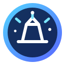

  

  

    

      OSSERVATORIO ASTRONOMICO REMOTO • MANCIANO (GR)
    

    <h1>Digital StarGate</h1>

    

      Astronomia, automazione e ingegneria dei dati
    

    

      Digital StarGate è il portale tecnico dell’Osservatorio Astronomico Remoto
      di Manciano: una piattaforma che integra documentazione, automazione,
      controllo operativo, analisi delle sessioni osservative e gestione
      dell’infrastruttura.
    

    

      <a class="md-button md-button--primary" href="./chapters/01-introduzione/">
        ▣
        Esplora il Manuale
        →
      </a>

      <a class="md-button" href="./analytics/">
        ▥
        Apri Analytics
        →
      </a>

      <a class="md-button" href="./session-reports/">
        ⌁
        Sessioni osservative
        →
      </a>
    

  

  

    

      
↗

      

        Release
        6.0
        Landing Page &amp; UX
      

    

    

      
☁

      

        GitHub Pages
        Online
        Pubblicazione automatica
      

    

    

      
⌁

      

        Analytics
        Attivo
        Elaborazione automatica
      

    

    

      
⌂

      

        Osservatorio
        Remoto
        Manciano (GR)
      

    

  

<section class="dsg-section-intro">
  ESPLORA LA PIATTAFORMA
  <h2>Un unico portale per documentazione, dati e operazioni</h2>
</section>

- :material-book-open-page-variant:{ .lg .middle } **Manuale tecnico**

    La documentazione completa dell’osservatorio.

    - Architettura del sistema
    - Infrastruttura e networking
    - Strumentazione astronomica
    - Software e automazione
    - Sicurezza e procedure
    - Manutenzione e troubleshooting

    [:octicons-arrow-right-24: Apri il manuale](chapters/01-introduzione.md)

- :material-chart-box:{ .lg .middle } **Analytics**

    Il portale di analisi delle sessioni osservative.

    - KPI operativi
    - Statistiche di acquisizione
    - Analisi dei target
    - Configurazioni utilizzate
    - Controlli di qualità
    - Report automatici

    [:octicons-arrow-right-24: Apri Analytics](analytics/index.md)

- :material-telescope:{ .lg .middle } **Sessioni osservative**

    L’archivio cronologico delle attività dell’osservatorio.

    - Report delle sessioni
    - Target osservati
    - Tempi di integrazione
    - Immagini acquisite
    - Dati di guida
    - Configurazioni strumentali

    [:octicons-arrow-right-24: Consulta le sessioni](session-reports/index.md)

- :material-tools:{ .lg .middle } **Engineering**

    Schemi e documentazione tecnica dell’infrastruttura.

    - Cablaggi
    - Schemi elettrici
    - Configurazioni
    - Asset hardware
    - Procedure di verifica
    - Checklist operative

    [:octicons-arrow-right-24: Apri Engineering](chapters/35-schemi-elettrici-cablaggi.md)

---

## La missione

> Progettare e documentare un osservatorio astronomico remoto affidabile, automatizzato ed evolutivo, capace di integrare strumenti astronomici, infrastruttura di rete, software di controllo e analisi dei dati in un unico ecosistema operativo.

Digital StarGate nasce dall’incontro tra passione astronomica, automazione e ingegneria del software. Ogni componente del sistema viene descritto, verificato e mantenuto secondo un approccio tecnico strutturato, documentato e replicabile.

---

## Panoramica operativa

<!-- DSG:AUTO-HOMEPAGE:START -->

  Sessioni
  0
  storico disponibile

  Integrazione
  0
  totale acquisito

  Immagini
  0
  light completati

  Target
  0
  oggetti distinti

### Ultima sessione

| Campo | Valore |
|---|---|
| Sessione | `2026-07-16_2026-07-17` |
| Data | 16/07/2026 18:00 → 17/07/2026 07:00 |
| Target | LDN 1320 |
| Configurazione | Sky-Watcher Quattro 200P · ToupTek 294MC PRO |
| Integrazione | 10,50 h |
| Immagini completate | 63 |
| RMS totale | 0,397 arcsec |
| Stato | 🟢 GREEN |

<!-- DSG:AUTO-HOMEPAGE:END -->

<section class="dsg-showcase">
  

  

    ULTIMA OSSERVAZIONE
    <h2>LDN 1320</h2>
    

      Ultima sessione registrata dal portale con acquisizione automatizzata,
      controllo della guida e monitoraggio dei parametri operativi.
    

    

      

        <strong>10,50 h</strong>
        Integrazione
      

      

        <strong>63</strong>
        Light completati
      

      

        <strong>0,397″</strong>
        RMS totale
      

    

    <a class="md-button md-button--primary" href="./session-reports/">
      Apri il report della sessione →
    </a>
  

</section>

<section class="dsg-roadmap">
  

    EVOLUZIONE DEL PROGETTO
    <h2>La roadmap di Digital StarGate</h2>
  

  

    <article class="dsg-timeline__item is-complete">
      
      

        2025
        <h3>Osservatorio operativo</h3>
        
Completamento della cupola, dell’infrastruttura remota e delle prime sessioni automatizzate.

      

    </article>

    <article class="dsg-timeline__item is-complete">
      
      

        2026 · Fase 1
        <h3>Manuale tecnico</h3>
        
Consolidamento della documentazione, delle procedure operative e della governance tecnica.

      

    </article>

    <article class="dsg-timeline__item is-current">
      
      

        2026 · Fase 2
        <h3>Analytics e session reporting</h3>
        
Automazione dei KPI, controllo della qualità e pubblicazione dei report delle sessioni.

      

    </article>

    <article class="dsg-timeline__item">
      
      

        Roadmap
        <h3>Osservatorio data-driven</h3>
        
Evoluzione del portale verso monitoraggio avanzato, automazioni predittive e analisi storica.

      

    </article>
  

</section>

---

## Accesso rapido

- :material-view-dashboard:{ .lg .middle } **Dashboard Analytics**

    Consulta KPI, grafici e statistiche delle sessioni.

    [:octicons-arrow-right-24: Apri la dashboard](analytics/dashboard.html)

- :material-clipboard-alert-outline:{ .lg .middle } **Dati da validare**

    Visualizza le informazioni che richiedono una verifica tecnica.

    [:octicons-arrow-right-24: Apri l’elenco](appendices/dati-da-validare.md)

- :material-file-document-edit-outline:{ .lg .middle } **Registro revisioni**

    Consulta la cronologia delle modifiche apportate alla documentazione.

    [:octicons-arrow-right-24: Consulta il registro](appendices/registro-revisioni.md)

---

## Informazioni sul progetto

| Campo | Valore |
|---|---|
| Documento | `DSG-TM-001` |
| Sistema | Digital StarGate |
| Proprietario | Massimo Mainini |
| Località | Manciano (GR) |
| Release del portale | 6.0 |
| Pubblicazione | GitHub Pages |
| Automazione | GitHub Actions |
| Stato | In continua evoluzione |

  

    
    

      <strong>Digital StarGate</strong>
      Osservatorio Astronomico Remoto · Manciano (GR)
    

  

  

    <a href="./chapters/01-introduzione/">Manuale</a>
    <a href="./analytics/">Analytics</a>
    <a href="./session-reports/">Sessioni</a>
    <a href="./status/">Stato</a>
  

  Release 6.0

!!! warning "Dati da validare"

    Tutti i valori contrassegnati come **DA VALIDARE** devono essere verificati direttamente sull’impianto prima della pubblicazione definitiva.
