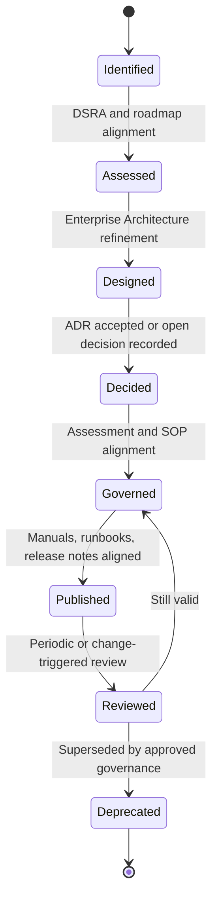
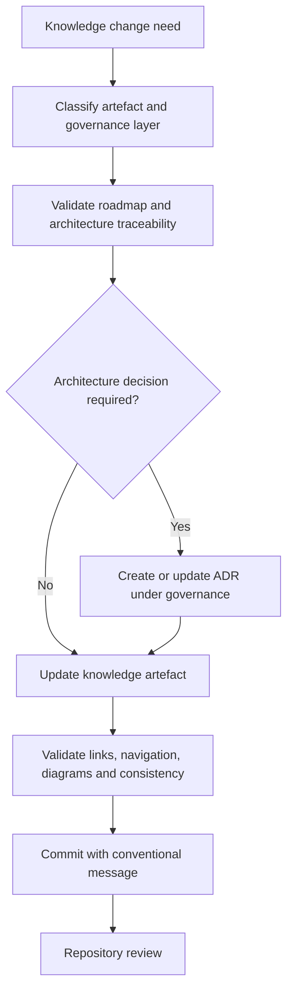

# Architecture Governance

**Document ID:** DSG-KF-GOV-001  
**Status:** Controlled Draft  
**Owner:** Chief Enterprise Architect / Knowledge Architect  
**Governance level:** Knowledge Framework  
**Roadmap authority:** DSG-MR-001  
**Preserved hierarchy:** DSG-MR-001 -> DSRA -> Enterprise Architecture -> ADR -> Assessments -> SOP -> Engineering Handbook -> Technical Manuals -> Runbooks -> Release Notes

## Purpose

This document describes how knowledge artefacts participate in Digital StarGate architecture governance. It refines repository knowledge management without modifying the Master Roadmap, DSRA, Enterprise Architecture, ADRs or existing governance documents.

## Governance Principles

| Principle | Application |
| --- | --- |
| Roadmap first | No Knowledge Framework artefact may contradict, replace, extend or bypass DSG-MR-001. |
| DSRA informed | Risk, safety and control knowledge remains traceable to DSRA before architecture refinement. |
| Architecture governed | Enterprise Architecture defines the domain, application, data, technology, security, integration and observability structure. |
| ADR controlled | Architecture choices are made or referenced through ADRs and the Architecture Decision Catalog. |
| SOP downstream | Procedures derive from assessments and architecture; Knowledge Framework documents do not operate as runbooks. |
| Open means open | Unknown facts are recorded as open decisions and are not filled with invented implementation details. |

## Architecture Lifecycle

## ADR Lifecycle

| State | Description | Entry evidence | Exit evidence |
| --- | --- | --- | --- |
| Proposed | Decision topic is identified from roadmap, DSRA, architecture or operational evidence. | Architecture or risk traceability. | Decision owner confirms scope. |
| Open | Required information is missing or options are not mature. | Open decision record. | Inputs become available. |
| Accepted | Decision is approved under existing governance. | ADR entry and architecture catalog reference. | Review or supersession trigger. |
| Superseded | Decision is replaced by a later approved ADR. | Superseding ADR reference. | Historical retention. |
| Deprecated | Decision no longer applies to active architecture. | Governance review evidence. | Archive retention. |

## SOP Lifecycle

| State | Description |
| --- | --- |
| Identified | A repeatable operational need is identified from architecture, assessment or incident evidence. |
| Draft | Procedure is written with trigger, roles, steps, output and controls. |
| Reviewed | Procedure is checked against architecture, risk, safety and manual evidence. |
| Active | Procedure is the governed operating reference. |
| Revised | Procedure is updated after architecture, equipment, safety or incident change. |
| Retired | Procedure is no longer active but remains traceable. |

## Manual Lifecycle

| State | Description |
| --- | --- |
| Draft | Manual content is created from architecture, SOP, equipment or engineering evidence. |
| Controlled | Manual is part of the governed documentation hierarchy. |
| Reviewed | Manual is checked for correctness, freshness and traceability. |
| Superseded | Manual is replaced by a newer controlled version. |
| Archived | Historical manual remains available for evidence and release traceability. |

## Versioning

| Artefact type | Versioning rule |
| --- | --- |
| Roadmap | Frozen according to roadmap governance. |
| DSRA | Versioned by risk governance; not modified by Knowledge Framework. |
| Enterprise Architecture | Versioned as architecture documentation; Knowledge Framework references it. |
| ADR | Immutable decision history with explicit supersession where applicable. |
| SOP | Versioned by operational procedure lifecycle. |
| Manuals | Versioned by controlled documentation lifecycle. |
| Knowledge Framework | Versioned by document history and repository commit evidence. |

## Approval Workflow

Knowledge Framework updates follow repository governance and do not introduce a separate approval authority.

## Review Workflow

| Review trigger | Required check |
| --- | --- |
| Roadmap milestone change | Confirm Knowledge Framework still derives from DSG-MR-001. |
| Architecture change | Update affected domain, data, requirement, glossary and traceability artefacts. |
| ADR accepted or superseded | Update Architecture Decision Catalog references and related knowledge entries. |
| SOP or manual update | Confirm downstream traceability remains intact. |
| Release preparation | Validate documentation freshness, broken links and release traceability. |
| Incident or safety event | Check whether DSRA, architecture, SOP or runbook evidence must be updated. |

## Deprecation Workflow

| Step | Description |
| --- | --- |
| Identify | Determine whether an artefact, term, requirement or relationship is obsolete. |
| Trace | Confirm impacted roadmap, DSRA, architecture, ADR, SOP and manual references. |
| Decide | Use ADR or governance review when the change affects architecture or operations. |
| Mark | Mark content as superseded or retired; do not silently delete governed knowledge. |
| Preserve | Retain historical references for audit and release evidence. |

## Document Ownership

| Document family | Owner |
| --- | --- |
| Master Roadmap | Roadmap Owner |
| DSRA | Risk Owner |
| Enterprise Architecture | Chief Enterprise Architect |
| ADR | Architecture Decision Owner |
| Assessments | Assessment Owner |
| SOP | Operations Owner |
| Engineering Handbook | Engineering Owner |
| Technical Manuals | Technical Owner |
| Runbooks | Operations Owner |
| Release Notes | Release Owner |
| Knowledge Framework | Knowledge Architect |

## Change Management

- Changes must be scoped to the lowest appropriate governance layer.
- A knowledge update may clarify terminology, relationships and traceability, but may not create new implementation commitments.
- If a change would alter architecture, security, data lifecycle, deployment, integration or operation policy, it must be handled through architecture governance and ADR where applicable.
- Repository updates must preserve MkDocs navigation and document discoverability.
- Commit messages should remain conventional and logically grouped.

## Open Knowledge Decisions

| Decision | Reason | Impact | Owner | Required input |
| --- | --- | --- | --- | --- |
| OKD-GOV-001 - Formal review cadence | Existing evidence does not define a recurring Knowledge Framework review cadence. | Affects freshness scoring and release readiness checks. | Knowledge Architect | Governance calendar decision. |
| OKD-GOV-002 - Named approval roles | Some owner roles are architectural role names rather than named individuals. | Affects accountability mapping. | Program Governance | Role assignment evidence. |
