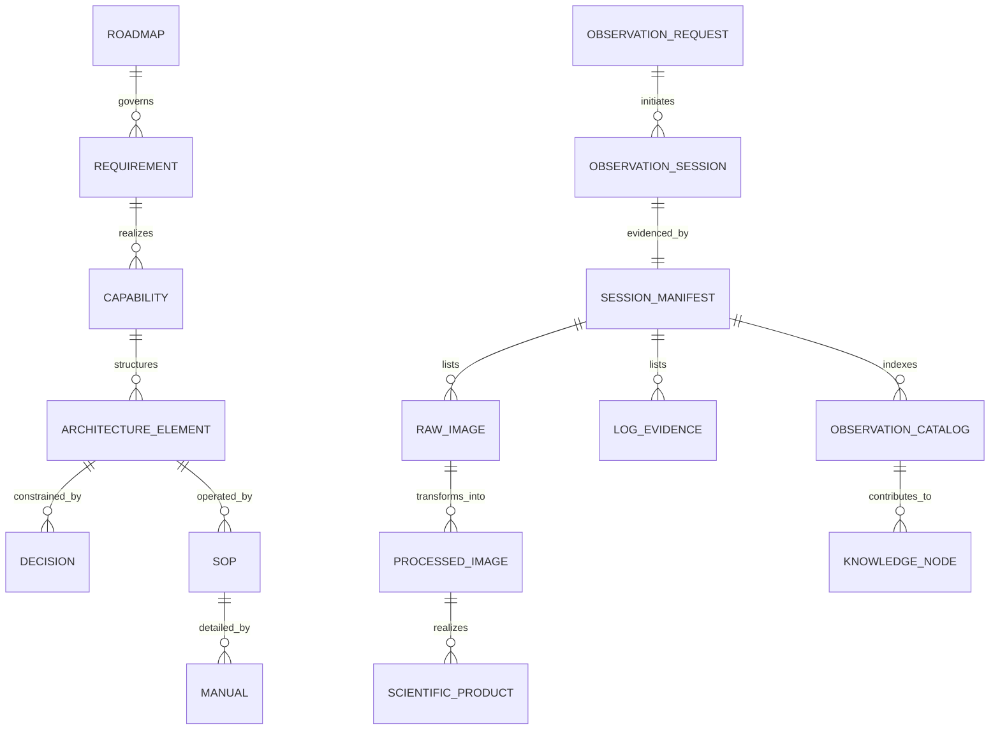
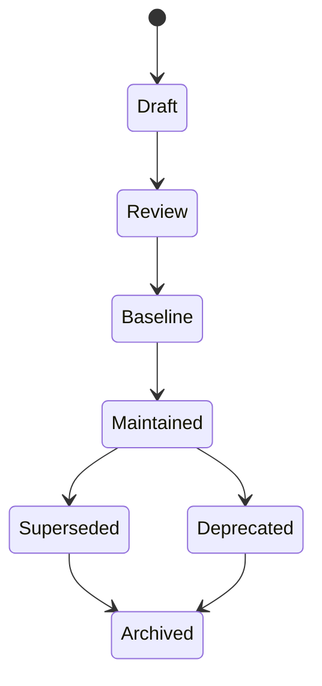

# DSG-KF-CIM-001 - Canonical Information Model

| Campo | Valore |
|---|---|
| Knowledge artefact | Canonical Information Model |
| Stato | Proposed knowledge baseline |
| Versione | 0.1 |
| Data | 2026-07-27 |
| Fonte gerarchica | `DSG-MR-001` |

## Scopo

Definire il modello informativo ufficiale per identificare, nominare, versionare e collegare gli oggetti di conoscenza Digital StarGate. Il modello e concettuale: non disegna database e non impone nuove implementazioni.

## Canonical Relationship Model

## Identifier Families

| Prefix | Object family | Example | Status |
|---|---|---|---|
| `DSG-MR` | Roadmap | `DSG-MR-001` | Existing |
| `DSRA` | Target/reference/risk architecture | `DSRA-001` | Existing |
| `DSG-EA` | Enterprise Architecture artefact | `DSG-EA-DA-001` | Proposed |
| `DSG-ESB` | Enterprise Solution Blueprint artefact | `DSG-ESB-001` | Existing/proposed |
| `ADR` / `DSG-ADR` | Architecture decision | `ADR-003`, `DSG-ADR-004` | Existing |
| `DSG-KF` | Knowledge Framework artefact | `DSG-KF-CIM-001` | Proposed |
| `DSG-REQ` | Requirement | `DSG-REQ-DATA-001` | Proposed |
| `DSG-CAP` | Capability | `DSG-CAP-OBS` | Existing in blueprint |
| `DSG-OBS` | Observation session/object | `DSG-OBS-YYYYMMDD-TARGET` | OPEN |
| `DSG-TGT` | Target | `DSG-TGT-M51` | OPEN |
| `DSG-AST` | Engineering/equipment asset | `DSG-AST-CGX-L` | OPEN |
| `DSG-CFG` | Configuration | `DSG-CFG-NINA-C8-LRGB` | OPEN |
| `OKD` | Open Knowledge Decision | `OKD-CIM-001` | Proposed |

## Naming Conventions

| Item | Convention | Source / note |
|---|---|---|
| Markdown document | kebab-case with stable semantic name | Existing repository pattern |
| Enterprise architecture page | `docs/enterprise-architecture/<layer>-architecture.md` | Existing EA section |
| Knowledge page | `docs/knowledge/<topic>.md` | This framework |
| Observation data folder | `observations/YYYY/YYYY-MM-DD_TARGET/...` | Capitolo 28 |
| FITS filename | `DATA_TARGET_TELESCOPIO_CAMERA_FILTRO_EXPOSURE_BIN_TEMPERATURA_PROGRESSIVO.fits` | Capitolo 28 |
| ADR | `ADR-### - Title` or `DSG-ADR-###` | Existing ADR index |
| Open decision | `OKD-AREA-###` for knowledge, `EA-OAD-###` for architecture | Decision catalogs |

## Canonical Metadata

| Metadata | Applies to | Purpose | Required status |
|---|---|---|---|
| Identifier | Documents, requirements, decisions, sessions, assets | Stable reference | Required when baseline |
| Title | All knowledge objects | Human-readable name | Required |
| Owner | Documents, data, assets, requirements | Accountability | Required or `Da validare` |
| Lifecycle status | All governed objects | AS-IS/Transition/TO-BE or workflow state | Required |
| Roadmap reference | Architecture/requirements/capabilities | Governance alignment | Required |
| DSRA reference | Architecture/security/operations | Risk/reference alignment | Required where applicable |
| ADR reference | Decisions/implemented choices | Decision traceability | Required or OPEN |
| SOP/manual reference | Operational objects | Execution traceability | Required where applicable |
| Version/date | Documents/configurations | Change control | Required |
| Sensitivity | Configurations, credentials, logs | Security classification | Required when sensitive |

## Status Model

| Status | Meaning |
|---|---|
| `AS-IS` | Documented current state |
| `Transition` | Being formalized/governed |
| `TO-BE` | Target capability not necessarily implemented |
| `TBD` | Known gap requiring definition |
| `Da validare` | Requires field or owner validation |
| `OPEN` | Governance decision not closed |
| `Accepted` | Approved ADR or baseline decision |
| `Superseded` | Replaced by newer artefact |
| `Deprecated` | Retained for history, not active |

## Traceability Rules

| Rule | Description |
|---|---|
| `CIM-TRC-001` | Every knowledge artefact references `DSG-MR-001`. |
| `CIM-TRC-002` | Architecture statements reference DSRA or Enterprise Architecture layer. |
| `CIM-TRC-003` | Operational objects reference SOP or technical manual. |
| `CIM-TRC-004` | Decisions are either linked to ADR/baseline decision or recorded as OPEN. |
| `CIM-TRC-005` | No entity should exist only in one table without source or relationship. |
| `CIM-TRC-006` | Unknown implementation details become Open Knowledge Decisions. |

## Lifecycle View

## Open Knowledge Decisions

| ID | Decision | Impact | Owner | Reason | Required input |
|---|---|---|---|---|---|
| `OKD-CIM-001` | Final observation/session identifier format | Data and archive traceability | Data Owner | Session ID convention is not yet fixed | Historical folders and report naming |
| `OKD-CIM-002` | Whether target/equipment registries use Markdown, CSV or warehouse-backed catalog | Repository quality and reuse | Data/Engineering Owner | Storage model is not decided | Maintainer workflow and analytics needs |
| `OKD-CIM-003` | Formal sensitivity taxonomy | Security and publication control | Security Owner | Current docs define no-secrets rule but not full taxonomy | Security classification model |
