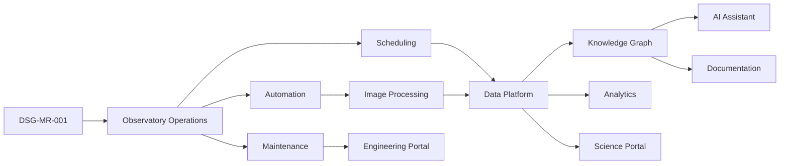

# Capability Maturity Model

**Document ID:** DSG-KF-CMM-001  
**Status:** Controlled Draft  
**Owner:** Chief Enterprise Architect / Knowledge Architect  
**Governance level:** Knowledge Framework  
**Roadmap authority:** DSG-MR-001  
**Traceability:** DSG-MR-001 -> DSRA -> Enterprise Architecture -> ADR -> Assessments -> SOP -> Manuals -> Runbooks -> Release Notes

## Purpose

This model evaluates the maturity of Digital StarGate business capabilities using repository-governed architecture evidence. It does not add implementation scope. Maturity gaps identify where future ADRs, SOPs, manuals, runbooks or release evidence must refine the knowledge base.

## Maturity Scale

| Level | Name | Meaning |
| --- | --- | --- |
| 0 | Not Represented | Capability is not yet represented in controlled documentation. |
| 1 | Identified | Capability is named and traceable to roadmap or architecture. |
| 2 | Defined | Scope, responsibilities, dependencies and primary artefacts are documented. |
| 3 | Governed | Decisions, controls, SOP relationships and ownership are documented. |
| 4 | Measured | Quality, observability, evidence and lifecycle metrics are defined. |
| 5 | Optimized | Capability has documented improvement loops and release evidence. |

## Capability Map

## Capability Assessment

| Capability | Current maturity | Target maturity | Gap | Roadmap milestone | Required architecture | Dependencies |
| --- | ---: | ---: | --- | --- | --- | --- |
| Observatory Operations | 3 | 4 | Operational metrics and release evidence require further refinement. | DSG-MR-001 | Business, Technology, Observability | Weather safety, equipment, remote access, SOPs |
| Automation | 3 | 4 | Automation evidence and recovery triggers need controlled operational metrics. | DSG-MR-001 | Application, Integration, Observability | N.I.N.A., ASCOM, CPWI, PHD2, runbooks |
| Scheduling | 2 | 4 | Scheduling policies, priorities and constraints are documented at architecture level but require ADR/SOP refinement. | DSG-MR-001 | Application, Data | Target Registry, Observation Request, weather constraints |
| Image Processing | 3 | 4 | Processing quality metrics and publication criteria require downstream refinement. | DSG-MR-001 | Application, Data, Integration | Calibration Library, PixInsight, ASTAP, archive |
| Data Platform | 3 | 4 | Retention classes and storage responsibilities remain open. | DSG-MR-001 | Data, Technology | NAS, cloud storage, observation catalog, archive |
| Knowledge Graph | 2 | 4 | Conceptual model is defined; ontology, storage and governance remain open. | DSG-MR-001 | Data, Knowledge Graph Model | Documentation assets, catalogs, ADRs, SOPs |
| AI Assistant | 2 | 4 | Recommendation governance, evidence handling and guardrails require open decisions. | DSG-MR-001 | Application, Security, Knowledge Graph | OpenAI, Knowledge Graph, documentation platform |
| Analytics | 2 | 4 | Metrics catalog and dashboard publication rules remain open. | DSG-MR-001 | Application, Observability, Data | Observation Catalog, processing metadata, maintenance evidence |
| Documentation | 4 | 5 | Knowledge quality metrics and freshness rules require operational cadence. | DSG-MR-001 | Repository Map, Governance, Taxonomy | MkDocs, GitHub, ADR, SOP, manuals |
| Maintenance | 2 | 4 | Maintenance workflow, evidence and runbook linkage require refinement. | DSG-MR-001 | Business, Technology, Observability | Equipment Registry, configuration, alerting |
| Science Portal | 2 | 4 | Publication, access and product readiness decisions remain open. | DSG-MR-001 | Application, Data, Security | Observation Catalog, scientific products, archive |
| Engineering Portal | 2 | 4 | Engineering evidence, configuration visibility and access model remain open. | DSG-MR-001 | Application, Security, Observability | Equipment Registry, monitoring, maintenance records |

## Capability Governance

- Each capability must remain traceable to DSG-MR-001 and the Enterprise Architecture layer.
- Capability changes that affect scope, risk, security, data lifecycle or operating procedures require ADR or controlled governance review.
- Maturity levels are evidence-based; a capability cannot be advanced only by assertion.
- Open capability gaps are not implementation commitments. They are governed knowledge items for future roadmap-aligned refinement.

## Maturity Summary

| Metric | Value |
| --- | ---: |
| Capabilities assessed | 12 |
| Average current maturity | 2.7 |
| Average target maturity | 4.1 |
| Capabilities at governed level or higher | 5 |
| Capabilities with open decision dependency | 7 |

## Open Knowledge Decisions

| Decision | Reason | Impact | Owner | Required input |
| --- | --- | --- | --- | --- |
| OKD-CMM-001 - Capability maturity acceptance criteria | Repository evidence does not yet define formal evidence thresholds for each maturity level. | Affects future advancement from Defined to Governed or Measured. | Chief Enterprise Architect | Governance criteria and assessment evidence model. |
| OKD-CMM-002 - Portal target maturity validation | Portal architecture exists, but release readiness and access rules are not finalized. | Affects Science, Engineering and Maintenance Portal maturity. | Chief Enterprise Architect | Portal ADRs and security decisions. |
