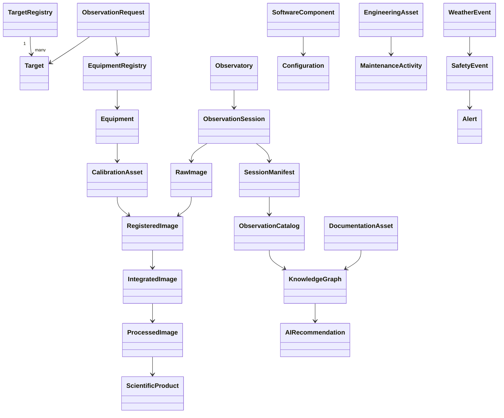

# DSG-KF-DM-001 - Domain Model

| Campo | Valore |
|---|---|
| Knowledge artefact | Domain Model |
| Stato | Proposed knowledge baseline |
| Versione | 0.1 |
| Data | 2026-07-27 |
| Fonte gerarchica | `DSG-MR-001` |
| Vincolo | Roadmap Freeze Policy |

## Scopo

Questo documento modella il dominio Digital StarGate come osservatorio astronomico automatizzato, collegando entita operative, dati scientifici, asset, configurazioni, manutenzione, documentazione e conoscenza. Il modello non progetta database e non introduce implementazioni.

## Canonical Domain View

## Entity Catalog

| Entity | Purpose | Description | Attributes | Relationships | Lifecycle | Owner | Related architecture documents | Related ADR | Related SOP |
|---|---|---|---|---|---|---|---|---|---|
| Observation Request | Capture intent to observe | Request for target/session planning | ID, target, objective, constraints, status | Target, Equipment Registry, Observation Session | Requested, Planned, Closed | Operations/Science Owner | Business, Application, Data Architecture | OPEN | Capitolo 17 |
| Target | Represent astronomical subject | Object to observe or publish | name, coordinates, type, season, priority | Target Registry, Observation Request, Catalog | Candidate, Planned, Observed, Published | Science Owner | Data Architecture | OPEN | OPEN |
| Target Registry | Govern targets | Controlled list of targets and observation state | target ID, coordinates, priority, filters, status | Target, Scheduler, Science Portal | Draft, Validated, Superseded | Science Owner | Application/Data Architecture | OPEN | OPEN |
| Equipment | Represent physical observing asset | CGX-L, C8, Quattro, cameras, focusers, filters, AllSky, weather assets | asset ID, model, role, status, config | Equipment Registry, Session, Calibration | Registered, Active, Maintained, Retired | Engineering Owner | Technology Architecture | OPEN | Capitoli 7-10,22 |
| Equipment Registry | Govern equipment knowledge | Asset/configuration register | asset ID, version, mapping, owner, status | Equipment, Configuration, Calibration | Draft, Validated, Superseded | Engineering Owner | Application/Data Architecture | OPEN | Capitolo 22 |
| Observatory | Represent operating site | Physical and operational observatory context | state, weather state, network state, safety state | Session, Weather Event, Safety Event | Closed, Ready, Open, Unsafe, Recovery | Operations Owner | Business/Technology/Security Architecture | ADR-001 | Capitoli 16,25,26 |
| Observation Session | Unit of operation and traceability | Execution of an observation with instruments and data | session ID, target, profile, start/end, status | Manifest, Raw Images, Logs, Catalog | Planned, Acquiring, Closed, Archived | Operations Owner | Application/Data/Observability Architecture | ADR-001 | Capitoli 16-17 |
| Session Manifest | Link session evidence | Manifest connecting files, logs, metadata, checksums | manifest ID, file list, hash, status | Session, Catalog, Archive | Draft, Verified, Archived | Data Owner | Data Architecture | OPEN | Capitolo 28 |
| Calibration Asset | Calibration data element | Dark, flat, bias, dark-flat, master calibration | type, camera, binning, temperature, validity | Equipment, Raw/Registered Images | Captured, Validated, Superseded | Imaging Owner | Data Architecture | OPEN | Capitoli 10,28 |
| Raw Image | Preserve original acquisition | FITS raw frame from N.I.N.A. | filename, FITS header, exposure, filter, status | Session, Calibration, Archive | Acquired, Verified, Archived | Data Owner | Data Architecture | OPEN | Capitoli 17,28 |
| Registered Image | Aligned/calibrated processing stage | Image registered for integration | source raw, calibration, registration status | Raw, Master Calibration, Integrated Image | Registered, Integrated, Discarded | Imaging Owner | Data Architecture | OPEN | Capitolo 28 |
| Integrated Image | Stacked image product | Integrated result from registered images | integration ID, source set, quality | Registered, Processed Image | Integrated, Processed, Archived | Imaging Owner | Data Architecture | OPEN | Capitolo 28 |
| Processed Image | Final processed visual/scientific asset | Post-processed image ready for review | processing version, export format, review state | Integrated Image, Scientific Product | Processed, Reviewed, Published | Imaging/Science Owner | Data Architecture | OPEN | Release docs |
| Scientific Product | Published scientific/astrophoto output | Image, measurement or publication candidate | product ID, metadata, publication status | Processed Image, Catalog, Portal | Candidate, Reviewed, Published, Archived | Science Owner | Business/Data Architecture | OPEN | OPEN |
| Observation Catalog | Curated observation index | Catalog of sessions, targets, metadata and products | catalog ID, session link, quality state | Manifest, KG, Analytics | Draft, Curated, Published | Data Owner | Data Architecture | ADR-003 | Capitolo 28 |
| Knowledge Graph | Semantic backbone concept | Conceptual network of entities and relationships | node type, relation, provenance, status | Catalog, Docs, ADR, AI | Proposed, Validated, Published | Knowledge Owner | Knowledge Graph Model | OPEN | OPEN |
| Engineering Asset | Technical maintainable item | Hardware, software, network or document asset | asset ID, owner, lifecycle, risk | Maintenance, Configuration | Registered, Active, Changed, Retired | Engineering Owner | Technology Architecture | OPEN | Capitoli 20-24 |
| Software Component | Application/system component | N.I.N.A., ASCOM, CPWI, PHD2, ASTAP, MkDocs, warehouse | component ID, version, role, status | Configuration, Session, Manuals | Installed, Validated, Updated, Retired | Engineering Owner | Application Architecture | ADR-001/002/003/004 where relevant | Capitoli 11-14 |
| Configuration | Controlled technical setting | Profiles, sequences, driver settings, router config, MkDocs config | config ID, scope, sensitivity, version | Software, Equipment, Backup | Draft, Validated, Changed, Archived | Engineering/Data Owner | Security/Technology Architecture | OPEN | Capitoli 20-21 |
| Maintenance Activity | Maintenance or recovery action | Preventive/corrective work on assets | activity ID, trigger, asset, outcome | Engineering Asset, Safety Event | Planned, Executed, Verified, Closed | Maintenance Owner | Observability/Security Architecture | OPEN | Capitoli 18-19,30-32 |
| Weather Event | Environmental state evidence | Weather readings or state transitions | timestamp, state, source, freshness | Observatory, Safety Event | Observed, Classified, Archived | Operations Owner | Observability Architecture | OPEN | Capitolo 26 |
| Safety Event | Operational safety occurrence | Unsafe, unknown, park/close or blocked operation | event ID, cause, severity, outcome | Weather, Observatory, Alert | Raised, Mitigated, Closed | Operations Owner | Security/Observability Architecture | ADR-001 | Capitoli 18,25,26 |
| Alert | Notification or escalation record | Operational notification, not autonomous control | alert ID, severity, channel, status | Safety Event, Maintenance | Raised, Acknowledged, Closed | Operations Owner | Observability Architecture | OPEN | OPEN |
| AI Recommendation | Human-reviewed AI output | Suggestion based on approved knowledge sources | recommendation ID, source, confidence, review | Knowledge Graph, Documentation | Draft, Reviewed, Accepted/Rejected | Governance Owner | Security/Application Architecture | OPEN | Governance AI |
| Documentation Asset | Knowledge-bearing document | Roadmap, DSRA, EA, ADR, SOP, manual, runbook, release note | doc ID, path, status, owner | Knowledge Graph, Traceability Matrix | Draft, Review, Approved, Superseded | Documentation Owner | Repository Map | DSG-ADR-004 | Release docs |

## Open Knowledge Decisions

| ID | Decision | Impact | Owner | Reason | Required input |
|---|---|---|---|---|---|
| `OKD-DM-001` | Final identifier schema for target, session, manifest and product | Traceability | Data/Science Owner | Not fully standardized in current repository | Historical examples and naming policy |
| `OKD-DM-002` | Formal attributes for Equipment Registry | Scheduling and calibration | Engineering Owner | Several hardware details are marked `DA VALIDARE` | Serial/version/config inventory |
| `OKD-DM-003` | Knowledge Graph implementation status | AI and semantic search | Knowledge Owner | KG is conceptual/TO-BE | Approved KG ADR before implementation |
