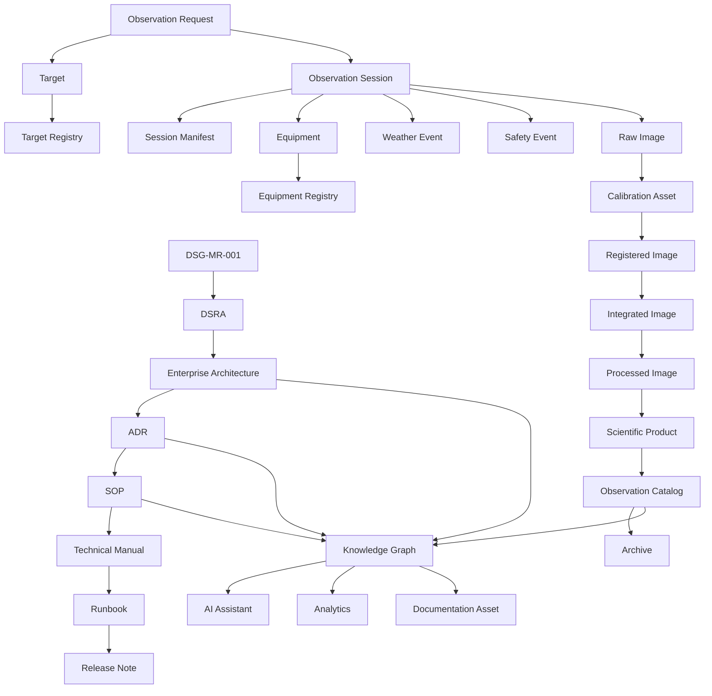

# Knowledge Graph Model

**Document ID:** DSG-KF-KGM-001  
**Status:** Controlled Draft  
**Owner:** Chief Enterprise Architect / Knowledge Architect  
**Governance level:** Knowledge Framework  
**Roadmap authority:** DSG-MR-001  
**Important constraint:** This document describes a conceptual graph only. It does not design a database, select a graph engine, define an API or create implementation work.

## Purpose

The Digital StarGate Knowledge Graph is the conceptual semantic structure that connects observatory operations, astronomical data, engineering assets, architecture, decisions, procedures and evidence.

Its role is to make relationships explicit so that the repository can support traceability, documentation quality, AI-assisted reasoning and scientific/engineering navigation without bypassing governance.

## Conceptual Graph View

## Node Families

| Node family | Examples | Purpose | Governance source |
| --- | --- | --- | --- |
| Governance nodes | Roadmap, DSRA, ADR, assessment, SOP, manual, runbook, release note | Preserve authority chain and lifecycle evidence. | Repository Map, Governance |
| Observatory nodes | Observatory, equipment, configuration, weather event, safety event, maintenance activity | Represent operating context and engineering state. | Technology and Observability Architecture |
| Observation nodes | Observation request, target, observation session, session manifest | Represent planning and execution context. | Business, Application and Data Architecture |
| Data product nodes | Raw image, calibration frame, master calibration, registered image, integrated image, processed image, scientific product | Represent astronomical data lifecycle and lineage. | Data Architecture |
| Knowledge nodes | Glossary term, requirement, capability, architecture element, open decision | Represent semantic control and traceability. | Knowledge Framework |
| Assistance nodes | AI recommendation, analytics insight, alert | Represent governed outputs that support human action. | Application and Observability Architecture |

## Relationship Types

| Relationship | Meaning | Example |
| --- | --- | --- |
| derives_from | Lower-level artefact derives authority from a higher-level artefact. | Enterprise Architecture derives_from DSG-MR-001. |
| assesses | Risk or assessment artefact evaluates an element. | DSRA assesses remote operations risk. |
| decides | ADR records a decision about an architecture element. | ADR decides technology or deployment approach. |
| governs | SOP or manual governs operation of a capability or asset. | SOP governs observation session execution. |
| requests | A request targets an object or session. | Observation Request requests Target. |
| executed_as | A planned observation becomes a session. | Observation Request executed_as Observation Session. |
| uses | Session, process or asset uses another asset. | Session uses Equipment. |
| produces | Process or session creates data. | Session produces Raw Image. |
| calibrates | Calibration asset is applied to image data. | Calibration Asset calibrates Raw Image. |
| transforms_to | Data object is transformed into a later lifecycle object. | Registered Image transforms_to Integrated Image. |
| catalogs | Catalog indexes products and metadata. | Observation Catalog catalogs Scientific Product. |
| supports | Knowledge or analytics supports a user capability. | Knowledge Graph supports AI Assistant. |
| triggers | Event causes alert, review or recovery. | Weather Event triggers Alert. |

## Semantic Domains

| Domain | Scope |
| --- | --- |
| Governance | Roadmap, DSRA, architecture, ADR, assessments, SOPs, manuals, runbooks and release notes. |
| Observatory Operations | Observatory, weather, safety, remote access, equipment and maintenance. |
| Observation Planning | Requests, target registry, scheduling and session preparation. |
| Acquisition | N.I.N.A., ASCOM, CPWI, PHD2, equipment state and raw images. |
| Data Lifecycle | Calibration, registration, integration, processing, catalog, publication and archive. |
| Knowledge Management | Glossary, requirements, capability maturity, taxonomy and quality metrics. |
| AI and Analytics | Governed recommendations, insights, alerts and dashboards. |

## Knowledge Sources

| Source | Contribution |
| --- | --- |
| DSG-MR-001 | Highest authority for scope, sequencing and governance. |
| DSRA | Risk, control and safety knowledge. |
| Enterprise Architecture | Business, application, data, technology, security, integration and observability structure. |
| Enterprise Solution Blueprint | Logical dependencies, component registry, data lifecycle and integration catalog. |
| ADR Catalog | Accepted and open architecture decisions. |
| SOPs and manuals | Operating procedures and durable technical knowledge. |
| Runbooks | Recovery and operational execution evidence. |
| Release notes | Released change history and readiness evidence. |

## Traceability Rules

- Every graph node that represents a controlled artefact must retain its source document reference.
- Every architecture element must trace back to DSG-MR-001 and forward to downstream evidence when available.
- AI Assistant outputs may reference graph knowledge but must not become decisions unless accepted through governance.
- Open decisions remain first-class graph nodes to prevent undocumented assumptions.

## Open Decisions

| Decision | Reason | Impact | Owner | Required input |
| --- | --- | --- | --- | --- |
| OKD-KGM-001 - Graph storage technology | Repository evidence does not authorize a graph database or storage implementation. | Conceptual graph cannot be translated into technology design. | Chief Enterprise Architect | ADR for graph storage if implementation is later approved. |
| OKD-KGM-002 - Ontology formalism | Repository evidence does not define whether formal ontology languages are required. | Affects semantic validation and interoperability. | Knowledge Architect | Architecture decision on ontology scope. |
| OKD-KGM-003 - AI recommendation evidence model | Repository evidence does not define required evidence structure for AI recommendations. | Affects auditability of AI-assisted outputs. | Chief Enterprise Architect | AI governance and security decisions. |
