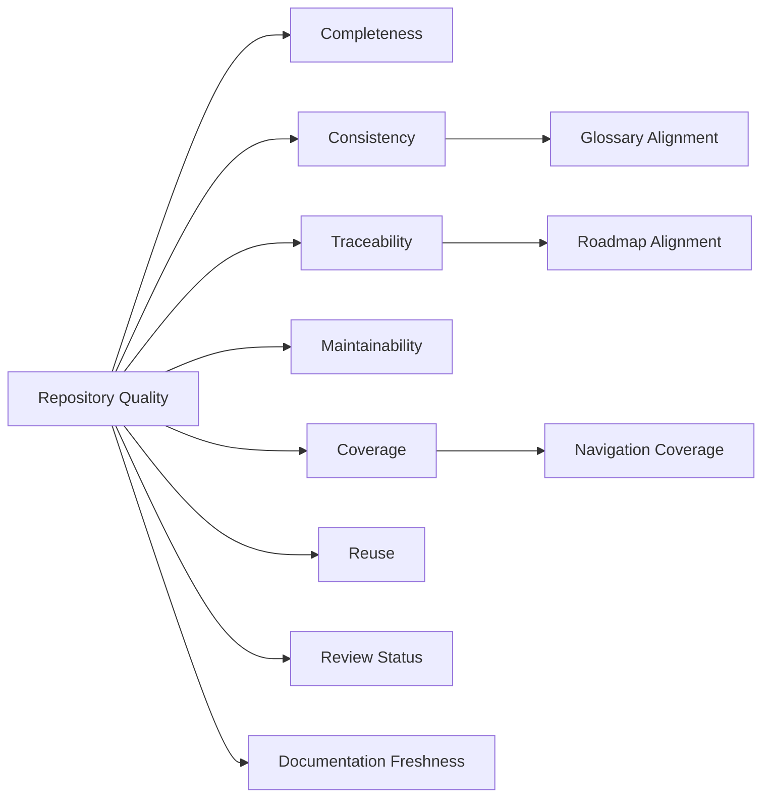
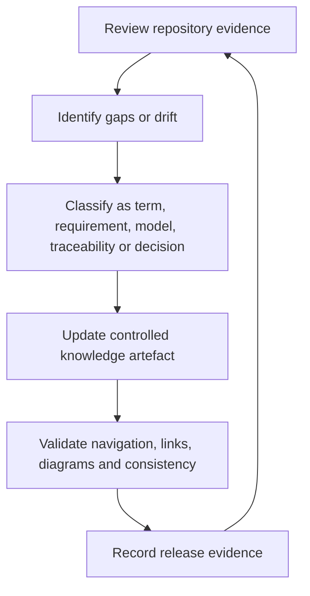

# Repository Quality Model

**Document ID:** DSG-KF-QLT-001  
**Status:** Controlled Draft  
**Owner:** Chief Enterprise Architect / Knowledge Architect  
**Governance level:** Knowledge Framework  
**Roadmap authority:** DSG-MR-001

## Purpose

This model defines quality dimensions for the Digital StarGate Enterprise Knowledge Repository. It supports review, release readiness and continuous improvement without creating implementation tooling or changing existing governance.

## Quality Model Overview

## Quality Dimensions

| Dimension | Definition | Evidence | Owner | Target |
| --- | --- | --- | --- | --- |
| Completeness | Required documents and required sections exist for the governed scope. | MkDocs navigation, file inventory, roadmap mapping. | Knowledge Architect | No missing mandatory Knowledge Framework artefacts. |
| Consistency | Terminology, identifiers, statuses and hierarchy are used consistently. | Enterprise Glossary, Repository Taxonomy, static review. | Knowledge Architect | No known contradictions with roadmap or architecture. |
| Traceability | Artefacts connect from roadmap to downstream evidence. | Traceability Matrix, document headers, cross references. | Chief Enterprise Architect | No orphan architecture elements. |
| Maintainability | Documents can be updated without duplicating source-of-truth content. | Taxonomy, ownership, lifecycle states. | Knowledge Architect | Clear owner and lifecycle for controlled artefacts. |
| Coverage | Navigation exposes created documents and architecture elements are represented. | `mkdocs.yml`, traceability matrix. | Documentation Owner | All Knowledge Framework pages reachable. |
| Reuse | Common definitions, entities and requirements are centralized. | Glossary, Domain Model, CIM, Requirements Repository. | Knowledge Architect | No duplicated canonical definitions. |
| Review Status | Review state is visible and governed. | Document status, commit evidence, release notes. | Governance Owner | Status present on controlled documents. |
| Documentation Freshness | Content remains current against roadmap, architecture, ADRs and operations. | Review date, change triggers, release evidence. | Document Owner | Open until formal cadence is defined. |

## Quality Checks

| Check | Method | Result classification |
| --- | --- | --- |
| Markdown syntax | Static review of headings, tables, code fences and document structure. | Passed / Failed |
| Navigation | Confirm created pages are present in MkDocs navigation. | Passed / Failed |
| Internal links | Confirm referenced repository paths exist or are governed layer references. | Passed / Failed / Open |
| Mermaid syntax | Confirm diagrams use valid Mermaid block types and balanced syntax. | Passed / Failed |
| Duplicate pages | Confirm no new page duplicates existing architecture or blueprint documents. | Passed / Failed |
| Hierarchy consistency | Confirm the immutable governance hierarchy is preserved. | Passed / Failed |
| Roadmap consistency | Confirm no Knowledge Framework document changes or contradicts DSG-MR-001. | Passed / Failed |
| Architecture consistency | Confirm knowledge artefacts refine, rather than redesign, architecture. | Passed / Failed |
| Open decisions | Confirm unknown facts are recorded as open decisions. | Passed / Failed |

## Scoring Guidance

| Score | Meaning |
| --- | --- |
| 0 | Not checked or no evidence. |
| 1 | Evidence exists but is incomplete or inconsistent. |
| 2 | Evidence is present and mostly consistent, with open decisions. |
| 3 | Evidence is complete for current governance phase. |

## Initial Knowledge Framework Quality Assessment

| Dimension | Score | Evidence | Notes |
| --- | ---: | --- | --- |
| Completeness | 3 | Ten requested Knowledge Framework documents created. | Complete for requested phase. |
| Consistency | 2 | Glossary, taxonomy and traceability matrix created. | Future review cadence remains open. |
| Traceability | 3 | 18 architecture elements mapped. | No orphan elements identified in requested scope. |
| Maintainability | 2 | Ownership and lifecycle defined. | Named owners and cadence remain open. |
| Coverage | 3 | MkDocs navigation section planned. | Subject to navigation update validation. |
| Reuse | 2 | Canonical models and glossary centralize recurring concepts. | Synonym policy remains open. |
| Review Status | 2 | Controlled Draft status applied. | Formal approval workflow not redefined. |
| Documentation Freshness | 1 | Review triggers defined. | Formal cadence remains open. |

## Repository Quality Metrics

| Metric | Definition | Current evidence |
| --- | --- | --- |
| Knowledge artefact completeness | Created artefacts divided by requested artefacts. | 10 / 10 after Knowledge Framework completion. |
| Glossary size | Number of controlled glossary terms. | 64 terms. |
| Requirement count | Number of requirements, constraints, assumptions and dependencies catalogued. | 42 entries. |
| Capability coverage | Number of requested capabilities assessed. | 12 capabilities. |
| Traceability coverage | Mapped architecture elements divided by identified architecture elements. | 18 / 18. |
| Open knowledge decisions | Number of unresolved knowledge-governance topics recorded. | Maintained in each artefact. |

## Continuous Improvement Loop

## Open Knowledge Decisions

| Decision | Reason | Impact | Owner | Required input |
| --- | --- | --- | --- | --- |
| OKD-QLT-001 - Documentation freshness threshold | Repository evidence does not define maximum age or review cadence per document class. | Freshness remains qualitative until governance sets thresholds. | Knowledge Architect | Review cadence and freshness policy. |
| OKD-QLT-002 - Automated quality tooling | This task does not introduce software or tooling, and repository evidence does not select validation automation. | Quality checks remain manual/static where MkDocs is unavailable. | Documentation Owner | Tooling decision if later authorized. |
| OKD-QLT-003 - Formal quality score acceptance | Repository evidence does not define release gates by quality score. | Scores inform review but do not yet govern release eligibility. | Program Governance | Release governance decision. |
