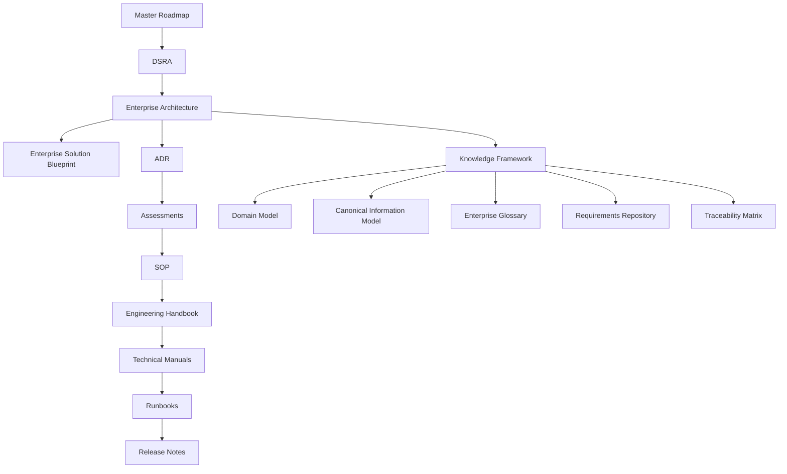

# Repository Taxonomy

**Document ID:** DSG-KF-TAX-001  
**Status:** Controlled Draft  
**Owner:** Chief Enterprise Architect / Knowledge Architect  
**Governance level:** Knowledge Framework  
**Roadmap authority:** DSG-MR-001

## Purpose

This taxonomy describes how Digital StarGate repository knowledge is organized, named, identified and cross-referenced. It preserves the governed hierarchy and avoids duplication between architecture, knowledge, procedures and operating documents.

## Repository Knowledge Structure

## Document Categories

| Category | Purpose | Typical location | Authority relationship |
| --- | --- | --- | --- |
| Roadmap | Scope, milestones, governance authority and freeze policy. | Roadmap documentation | Highest authority |
| DSRA | Risk, safety, controls and mitigation evidence. | DSRA documentation | Derived from roadmap |
| Enterprise Architecture | Business, application, data, technology, security, integration and observability architecture. | `docs/enterprise-architecture/` | Derived from DSRA |
| Enterprise Solution Blueprint | Logical decomposition, data flows, component registry and integration catalog. | `docs/enterprise-solution-blueprint/` | Architecture refinement |
| ADR | Approved and open architecture decisions. | ADR structure | Derived from architecture |
| Assessments | Evaluation evidence and readiness reviews. | Assessment documentation | Derived from ADR |
| SOP | Standard operating procedures. | SOP documentation | Derived from assessments |
| Engineering Handbook | Contributor, maintainer and engineering guidance. | Handbook documentation | Derived from SOP |
| Technical Manuals | Stable technical reference material. | Manual documentation | Derived from handbook |
| Runbooks | Operational execution and recovery procedures. | Runbook documentation | Derived from manuals |
| Release Notes | Release history and readiness evidence. | Release documentation | Derived from runbooks |
| Knowledge Framework | Semantic model, glossary, requirements, traceability and quality. | `docs/knowledge/` | Cross-layer semantic backbone |

## Naming Conventions

| Artefact | Naming rule | Example |
| --- | --- | --- |
| Knowledge document | Lowercase kebab-case file name under `docs/knowledge/`. | `domain-model.md` |
| Requirement | `DSG-<family>-NNN`. | `DSG-FR-001` |
| Open Knowledge Decision | `OKD-<document>-NNN`. | `OKD-KGM-001` |
| Architecture element | Stable domain or capability name matching Enterprise Architecture terminology. | `Observation Session Manager` |
| Information object | Singular canonical name. | `Session Manifest` |
| Glossary term | Preferred term with capitalization matching repository usage. | `Knowledge Graph` |

## Identifier Families

| Prefix | Meaning |
| --- | --- |
| `DSG-KF` | Knowledge Framework document identifier. |
| `DSG-BR` | Business requirement. |
| `DSG-FR` | Functional requirement. |
| `DSG-NFR` | Non functional requirement. |
| `DSG-OPR` | Operational requirement. |
| `DSG-SEC` | Security requirement. |
| `DSG-DAT` | Data requirement. |
| `DSG-QLT` | Quality requirement. |
| `DSG-CON` | Constraint. |
| `DSG-ASM` | Assumption. |
| `DSG-DEP` | Dependency. |
| `OKD` | Open Knowledge Decision. |

## Folder Strategy

| Folder | Role |
| --- | --- |
| `docs/enterprise-architecture/` | Architecture viewpoints and repository map. |
| `docs/enterprise-solution-blueprint/` | Logical solution decomposition, data architecture, component registry and integrations. |
| `docs/knowledge/` | Semantic knowledge layer created by this framework. |
| ADR folders | Architecture decision records and decision catalog references. |
| SOP/manual/runbook folders | Downstream operational and technical evidence. |

## Cross-Reference Rules

- Use relative repository paths for document references where possible.
- Reference authoritative documents rather than duplicating their content.
- Use architecture document names consistently: Business Architecture, Application Architecture, Data Architecture, Technology Architecture, Security Architecture, Integration Architecture and Observability Architecture.
- Where exact downstream document identifiers are not available, reference the governed layer and record the gap as an open knowledge decision.
- Do not create duplicate definitions in multiple documents; glossary definitions are authoritative for terminology.

## Document Lifecycle

| Lifecycle state | Meaning |
| --- | --- |
| Controlled Draft | Document is governed and ready for review but may contain open decisions. |
| Approved | Document is accepted under repository governance. |
| Active | Document is the current operational or architectural reference. |
| Superseded | Document is replaced by a newer governed artefact. |
| Archived | Document is retained for traceability but no longer active. |

## Open Knowledge Decisions

| Decision | Reason | Impact | Owner | Required input |
| --- | --- | --- | --- | --- |
| OKD-TAX-001 - Complete folder-to-layer registry | Repository evidence should be periodically checked for all downstream folder names and document families. | Affects exact taxonomy automation and link validation. | Knowledge Architect | Full repository file inventory at release time. |
| OKD-TAX-002 - Identifier registry ownership | Repository evidence does not define a single owner for all identifier families. | Affects long-term collision prevention. | Program Governance | Ownership assignment. |
