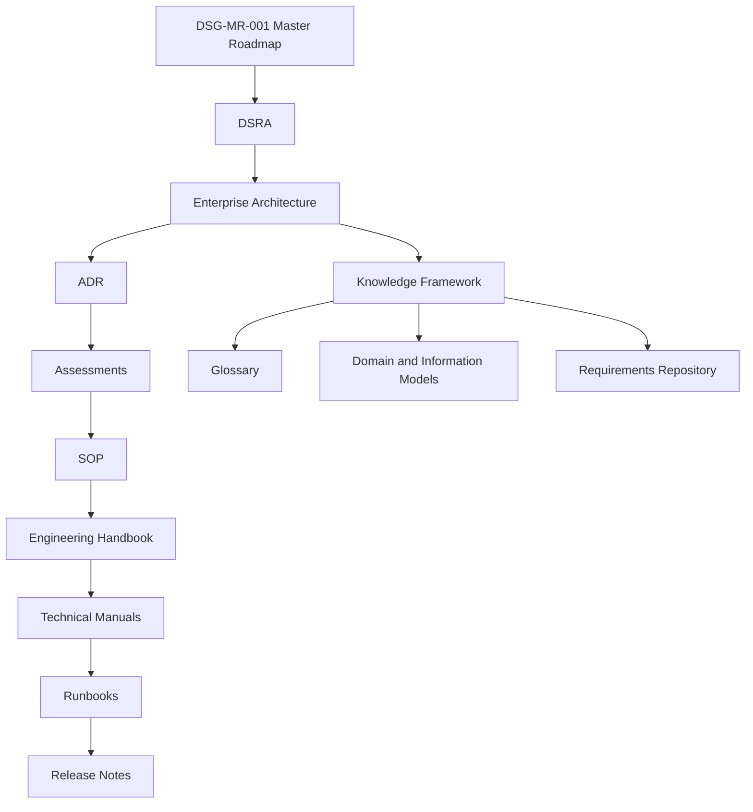

# Traceability Matrix

**Document ID:** DSG-KF-TRC-001  
**Status:** Controlled Draft  
**Owner:** Chief Enterprise Architect / Knowledge Architect  
**Governance level:** Knowledge Framework  
**Roadmap authority:** DSG-MR-001  
**Traceability rule:** No orphan architectural or knowledge element is allowed.

## Purpose

This matrix connects the Digital StarGate governance chain from roadmap authority to release evidence. It is a knowledge-control artefact and does not modify the Master Roadmap, DSRA, Enterprise Architecture, ADRs or Governance.

## Governance Chain

## Architecture-to-Knowledge Traceability

| Element | Roadmap | DSRA | Architecture | ADR | Assessment | SOP | Manual | Runbook | Release Notes | Knowledge artefact | Coverage |
| --- | --- | --- | --- | --- | --- | --- | --- | --- | --- | --- | --- |
| Observatory Operations | DSG-MR-001 | DSRA | Business / Technology / Observability | ADR catalog | Assessments layer | SOP layer | Manuals layer | Runbooks layer | Release layer | Domain Model, CMM | Covered |
| Automation | DSG-MR-001 | DSRA | Application / Integration | ADR catalog | Assessments layer | SOP layer | Manuals layer | Runbooks layer | Release layer | Requirements, CMM | Covered |
| Scheduling | DSG-MR-001 | DSRA | Application / Data | ADR catalog | Assessments layer | SOP layer | Manuals layer | Runbooks layer | Release layer | Requirements, CMM | Covered |
| Equipment Registry | DSG-MR-001 | DSRA | Application / Data / Technology | ADR catalog | Assessments layer | SOP layer | Manuals layer | Runbooks layer | Release layer | Domain Model, CIM | Covered |
| Target Registry | DSG-MR-001 | DSRA | Application / Data | ADR catalog | Assessments layer | SOP layer | Manuals layer | Runbooks layer | Release layer | Domain Model, CIM | Covered |
| Calibration | DSG-MR-001 | DSRA | Data / Application | ADR catalog | Assessments layer | SOP layer | Manuals layer | Runbooks layer | Release layer | Domain Model, Glossary | Covered |
| Imaging | DSG-MR-001 | DSRA | Application / Integration / Data | ADR catalog | Assessments layer | SOP layer | Manuals layer | Runbooks layer | Release layer | Domain Model, Requirements | Covered |
| Image Processing | DSG-MR-001 | DSRA | Application / Data / Integration | ADR catalog | Assessments layer | SOP layer | Manuals layer | Runbooks layer | Release layer | CMM, Glossary | Covered |
| Data Platform | DSG-MR-001 | DSRA | Data / Technology | ADR catalog | Assessments layer | SOP layer | Manuals layer | Runbooks layer | Release layer | CIM, Requirements | Covered |
| Observation Archive | DSG-MR-001 | DSRA | Data / Technology | ADR catalog | Assessments layer | SOP layer | Manuals layer | Runbooks layer | Release layer | CIM, Repository Quality | Covered |
| Knowledge Graph | DSG-MR-001 | DSRA | Data / Application | ADR catalog | Assessments layer | SOP layer | Manuals layer | Runbooks layer | Release layer | KG Model, Glossary | Covered |
| AI Assistant | DSG-MR-001 | DSRA | Application / Security | ADR catalog | Assessments layer | SOP layer | Manuals layer | Runbooks layer | Release layer | KG Model, Requirements | Covered |
| Analytics | DSG-MR-001 | DSRA | Application / Observability | ADR catalog | Assessments layer | SOP layer | Manuals layer | Runbooks layer | Release layer | CMM, Quality Model | Covered |
| Documentation Platform | DSG-MR-001 | DSRA | Application / Repository Map | ADR catalog | Assessments layer | SOP layer | Manuals layer | Runbooks layer | Release layer | Taxonomy, Glossary | Covered |
| Science Portal | DSG-MR-001 | DSRA | Application / Security / Data | ADR catalog | Assessments layer | SOP layer | Manuals layer | Runbooks layer | Release layer | Requirements, CMM | Covered |
| Engineering Portal | DSG-MR-001 | DSRA | Application / Security / Observability | ADR catalog | Assessments layer | SOP layer | Manuals layer | Runbooks layer | Release layer | Requirements, CMM | Covered |
| Maintenance Portal | DSG-MR-001 | DSRA | Application / Technology / Observability | ADR catalog | Assessments layer | SOP layer | Manuals layer | Runbooks layer | Release layer | Domain Model, CMM | Covered |
| Security and Remote Operations | DSG-MR-001 | DSRA | Security / Technology / Integration | ADR catalog | Assessments layer | SOP layer | Manuals layer | Runbooks layer | Release layer | Requirements, Governance | Covered |

## Requirement Traceability

| Requirement family | Roadmap | Architecture | Knowledge artefact | Open decision handling |
| --- | --- | --- | --- | --- |
| Business | DSG-MR-001 | Business Architecture | Requirements Repository | Gaps recorded as OKD or EA-OAD |
| Functional | DSG-MR-001 | Application / Data / Integration | Requirements Repository | Gaps recorded as OKD or EA-OAD |
| Non Functional | DSG-MR-001 | Observability / Technology / Security | Requirements Repository | Gaps recorded as OKD or EA-OAD |
| Operational | DSG-MR-001 | Technology / Observability | Requirements Repository | Gaps recorded as OKD or EA-OAD |
| Security | DSG-MR-001 | Security Architecture | Requirements Repository | Gaps recorded as OKD or EA-OAD |
| Data | DSG-MR-001 | Data Architecture | Canonical Information Model | Gaps recorded as OKD or EA-OAD |
| Quality | DSG-MR-001 | Repository Quality Model | Repository Quality Model | Gaps recorded as OKD |

## Document Traceability Rules

| Rule | Required evidence |
| --- | --- |
| Roadmap authority | Every controlled Knowledge Framework document references DSG-MR-001. |
| Architecture alignment | Domain, information, requirement and quality artefacts reference Enterprise Architecture or Enterprise Solution Blueprint documents. |
| ADR preservation | Existing ADRs are referenced through the Architecture Decision Catalog and are not modified here. |
| SOP alignment | SOP references are recorded by layer where specific SOP identifiers are not yet available in repository evidence. |
| Manual/runbook alignment | Manuals and runbooks remain downstream governed evidence and are not replaced by knowledge documents. |
| Open decisions | Unresolved facts remain in Open Knowledge Decisions or existing architecture open-decision catalogues. |

## Traceability Coverage Summary

| Metric | Value |
| --- | ---: |
| Architecture elements mapped | 18 |
| Architecture elements with roadmap reference | 18 |
| Architecture elements with DSRA layer reference | 18 |
| Architecture elements with architecture reference | 18 |
| Architecture elements with downstream governance layer reference | 18 |
| Orphan architecture elements identified | 0 |

## Open Knowledge Decisions

| Decision | Reason | Impact | Owner | Required input |
| --- | --- | --- | --- | --- |
| OKD-TRC-001 - Specific SOP/manual/runbook identifiers | Repository evidence available to this task does not provide a complete per-element downstream identifier map. | Traceability uses governance layers where specific IDs are unavailable. | Knowledge Architect | Complete downstream document registry evidence. |
| OKD-TRC-002 - Release evidence mapping | Release notes layer exists in the hierarchy, but per-element release traceability is not finalized here. | Future release readiness checks require exact release references. | Release Owner / Knowledge Architect | Release documentation catalogue. |
