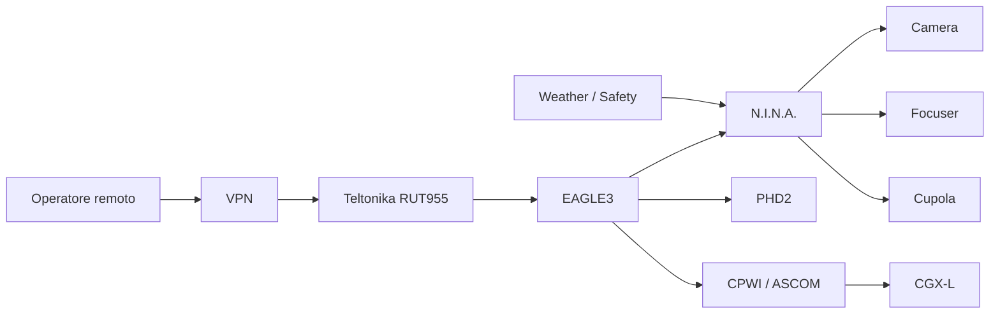

# Observatory Overview

Digital StarGate è un osservatorio remoto dedicato ad acquisizione astronomica, automazione, monitoraggio e produzione di dati scientifici e divulgativi.

## Catena operativa principale

## Principi

- safety prima della continuità della sessione;
- controllo locale resiliente anche con perdita WAN;
- separazione tra asset fisici, servizi software e workflow;
- ripristino verso una configurazione nota e documentata.
