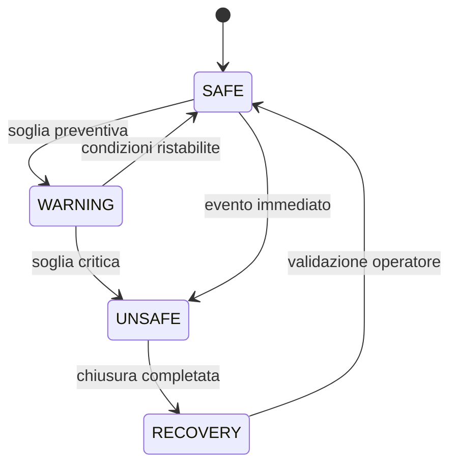

# Observatory Safety

## Regola fondamentale

Uno stato `UNSAFE` deve prevalere su qualunque attività scientifica in corso.

## Azioni minime in stato UNSAFE

1. interrompere o non avviare nuove esposizioni;
2. arrestare la guida;
3. parcheggiare la montatura quando possibile;
4. chiudere la cupola;
5. portare i carichi in stato sicuro;
6. registrare evento e correlation ID;
7. notificare l'operatore.

## Fail-safe

La chiusura della cupola deve poter essere eseguita anche in caso di perdita della connessione Internet.
