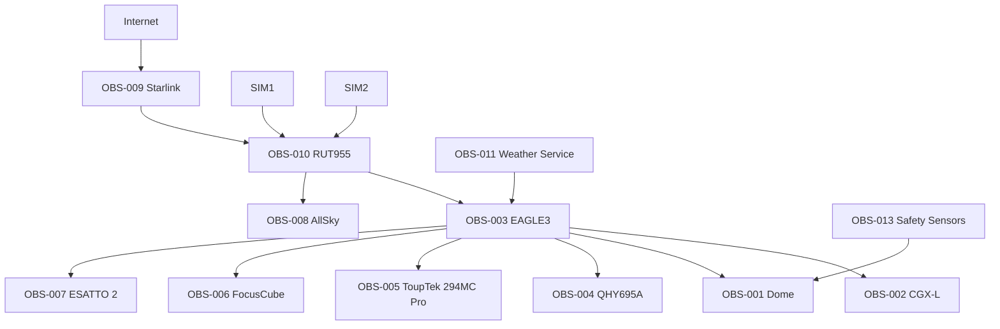

# Observatory Topology

## Zone logiche

- **WAN:** Starlink e LTE.
- **Edge networking:** RUT955, VPN, routing e failover.
- **Control plane:** EAGLE3 e stack software.
- **Device plane:** montatura, camere, focheggiatori e cupola.
- **Safety plane:** sensori, stato meteo e interlock.
