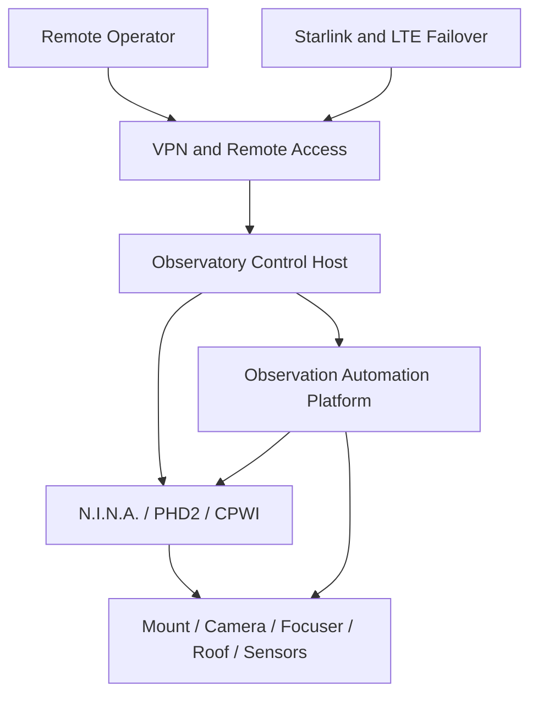

# Deployment Topology

## 1. Baseline topology

The first platform deployment is local-first and centred on the observatory control host.

## 2. Deployment units

| Unit | Location | Purpose |
|---|---|---|
| Platform Runtime | Observatory control host | Executes orchestration, safety and integration services |
| Configuration Store | Local persistent storage | Stores plans, profiles and policies |
| Event and Telemetry Store | Local persistent storage | Stores operational evidence and metrics |
| Operator Client | Remote workstation | Submits commands and reviews status |
| Optional Replication Target | Remote or cloud location | Receives non-critical backups and reports |

## 3. Connectivity assumptions

- local device communication remains available during WAN outage;
- remote VPN access may be unavailable without affecting safety shutdown;
- Starlink is the preferred WAN path;
- LTE connections provide failover where configured;
- no cloud service is required to close the observatory safely.

## 4. Availability zones

The baseline uses one physical observatory zone. Availability is therefore achieved through:

- local autonomy;
- redundant connectivity;
- independent safety sensors;
- controlled restart procedures;
- configuration and event backups.

## 5. Data placement

Safety state, current session state and active configuration must be stored locally. Remote replication is asynchronous and must not block runtime actions.

## 6. Deployment evolution

Future versions may separate API, telemetry and reporting services, but the safety evaluator and session recovery functions must remain executable locally.
