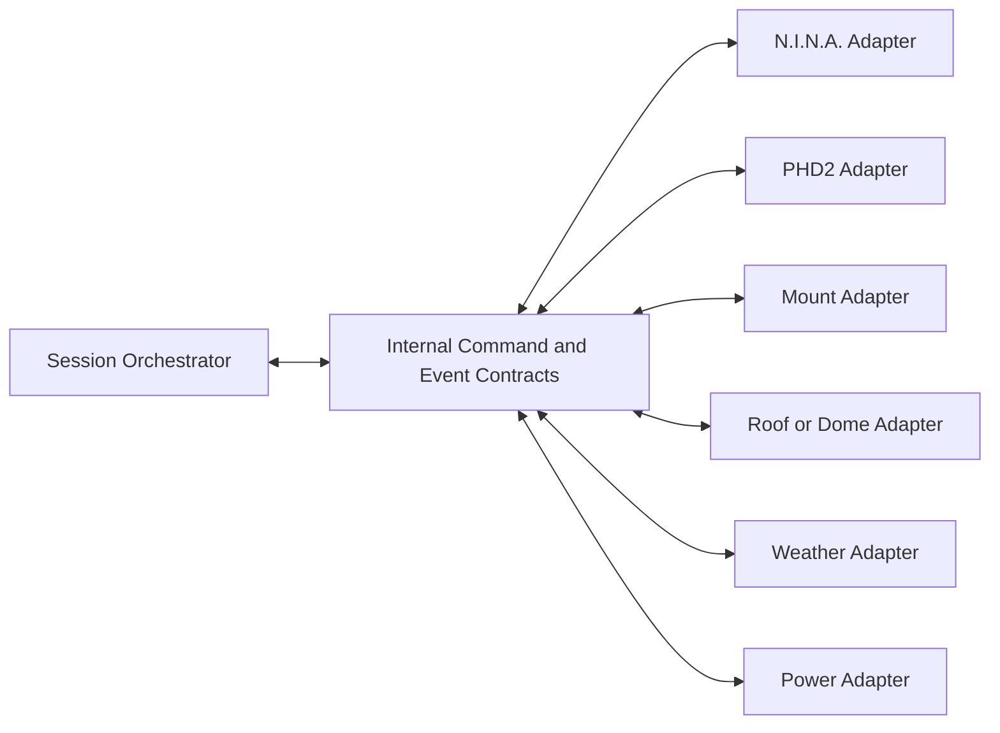

# Integration Architecture

## 1. Integration strategy

The platform integrates with observatory applications and devices through normalized adapters. The orchestration layer must not depend on vendor-specific APIs or driver semantics.

## 2. Integration pattern

## 3. Contract categories

### Commands

Examples:

- `prepareEquipment`;
- `openEnclosure`;
- `startGuiding`;
- `startSequence`;
- `parkMount`;
- `closeEnclosure`;
- `shutdownEquipment`.

### Queries

Examples:

- `getSafetyState`;
- `getMountState`;
- `getGuidingState`;
- `getSequenceProgress`;
- `getEnclosureState`.

### Events

Examples:

- `SafetyStateChanged`;
- `MountParked`;
- `GuidingLost`;
- `SequenceCompleted`;
- `EnclosureClosed`;
- `RecoveryStarted`.

## 4. Reliability requirements

- Commands must define timeout and retry behaviour.
- Duplicate commands must be safely handled.
- Adapter failures must be isolated from the orchestrator process where practical.
- The last known device state must be timestamped.
- Stale telemetry must never be interpreted as current safe state.
- Safety-critical commands require explicit acknowledgement.

## 5. External connectivity

Remote access is a management channel, not a runtime dependency. The local platform continues to evaluate safety and execute shutdown when WAN or VPN connectivity is lost.

## 6. Security controls

- authenticated API access;
- role-based authorization;
- command audit trail;
- configuration integrity checks;
- no direct public exposure of device endpoints;
- encrypted remote-management channels.
