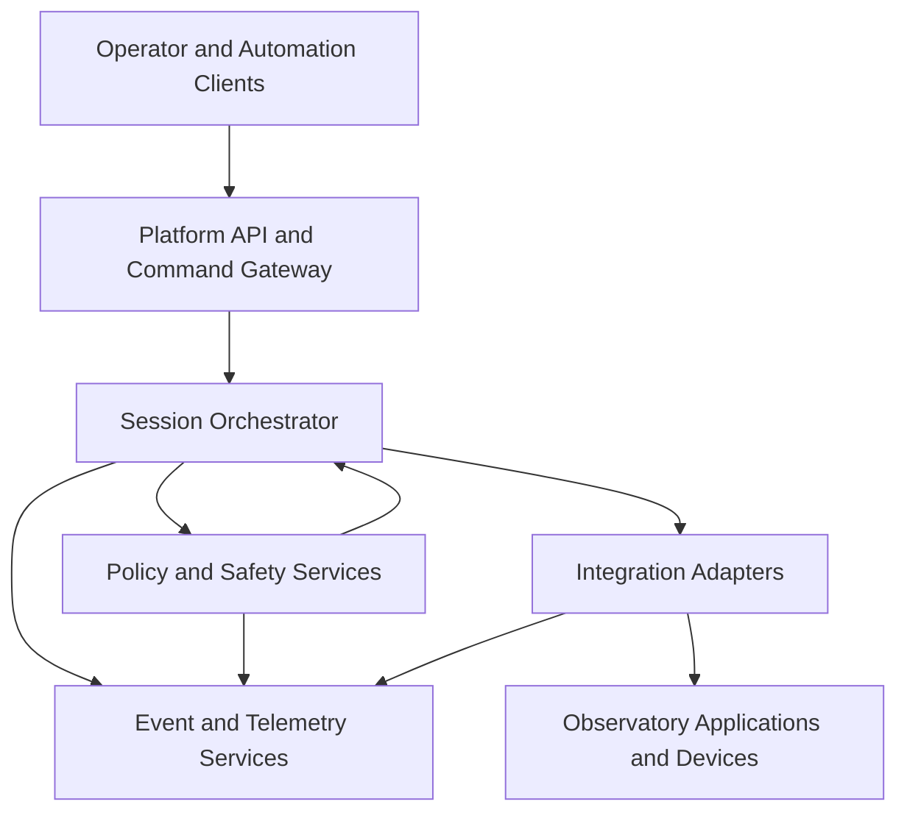

# Platform Overview

## 1. Architectural intent

The platform provides a stable boundary between observation-session logic and the heterogeneous hardware and software used by the observatory.

The objective is to avoid embedding vendor-specific details directly inside orchestration rules. Instead, platform services expose normalized contracts and delegate execution to adapters.

## 2. Logical layers

## 3. Core characteristics

### Local-first runtime

Session execution occurs on the observatory control host. Loss of Internet connectivity must not interrupt safety decisions or controlled shutdown.

### Adapter-based integration

N.I.N.A., PHD2, CPWI, ASCOM devices, weather sensors and roof or dome controllers are accessed through dedicated adapters.

### Policy-driven decisions

Safety thresholds, timeout rules, retry policies and recovery strategies are represented as configuration and evaluated consistently.

### Event-driven evidence

Commands, responses, state transitions, warnings and recovery actions are emitted as structured events.

## 4. Primary platform services

- Command Gateway;
- Session Orchestrator;
- Safety Policy Service;
- Equipment Coordination Service;
- Scheduler Service;
- Configuration Service;
- Event Store;
- Telemetry Collector;
- Notification Service;
- Health and Diagnostics Service.

## 5. Non-functional priorities

| Priority | Objective |
|---|---|
| Safety | Prevent unsafe opening, continued acquisition or shutdown failure |
| Availability | Continue locally during WAN degradation |
| Recoverability | Return to a known state after component failure |
| Auditability | Record actions and decisions with timestamps and correlation identifiers |
| Maintainability | Isolate changes in hardware and vendor applications |
| Security | Restrict remote commands and protect configuration |
