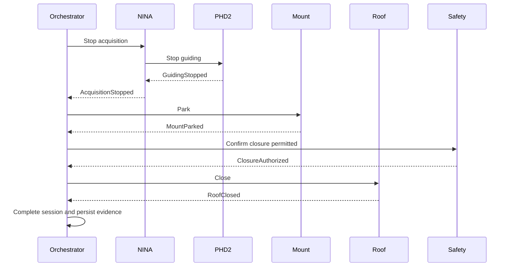

# Controlled Shutdown Sequence

## Sequence

## Invariants

- roof closure has precedence over non-essential data operations;
- the mount must be parked or confirmed in a closure-safe position;
- failure to confirm roof closure raises a critical alert;
- telemetry and event evidence remain available after shutdown.
