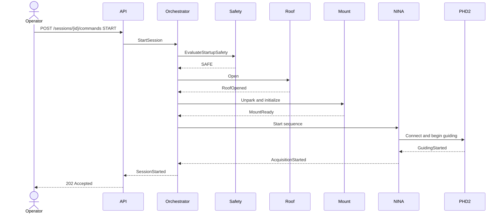

# Session Startup Sequence

## Preconditions

- session plan is valid;
- observatory runtime is reachable;
- safety state is `SAFE` and fresh;
- roof and mount state are known;
- required device adapters are healthy.

## Sequence

## Failure rules

- no opening command is sent when safety is unknown;
- roof-open timeout triggers controlled closure where safe;
- mount initialization failure prevents sequence start;
- every partial startup records compensating actions and evidence.
