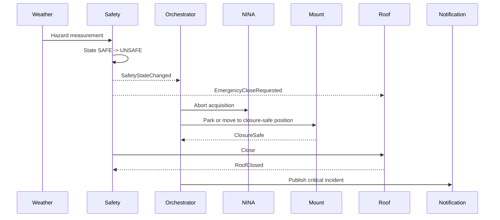

# Unsafe Weather Emergency Sequence

## Trigger

The independent safety authority changes state to `UNSAFE` because of rain, excessive wind, humidity, telemetry loss or another configured hazard.

## Safety priority

The safety controller may command closure without waiting for the orchestration service. The orchestrator coordinates graceful actions when available but is not the authority that decides whether unsafe conditions exist.

## Evidence

The incident record contains sensor values, safety policy version, command timeline, acknowledgements, final roof state and unresolved faults.
