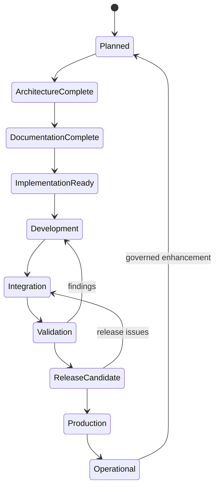

# REL-000 - Release Management Baseline

| Campo | Valore |
|---|---|
| Documento | Release Management Baseline |
| ID | `REL-000` |
| Stato | Official Release Management Baseline |
| Versione | 1.0 |
| Data | 2026-07-27 |
| Owner | Release Manager / Enterprise Governance Architect |
| Fonte gerarchica | `DSG-MR-001` -> DSRA -> Enterprise Architecture -> Knowledge Framework -> Design System -> Capability Registry -> Release Management |
| Ambito | Governo delle release documentali, architetturali, capability e piattaforma |

## Purpose

Il Release Management Baseline definisce come Digital StarGate promuove capability, documentazione, decisioni, procedure, test, criteri di accettazione e release notes lungo la catena di governance approvata.

Il documento non introduce implementazione software, non prescrive tooling e non modifica roadmap, DSRA, Enterprise Architecture, Knowledge Framework, Design System o Capability Registry.

## Scope

Il baseline copre:

- lifecycle delle release;
- versioning governance-oriented;
- promotion rules per capability;
- readiness checklist;
- release types;
- artefatti obbligatori;
- quality gates;
- sincronizzazione con `CAP-000`;
- struttura calendario release;
- metriche;
- compliance;
- continuous improvement.

Sono esclusi:

- sviluppo software;
- pipeline CI/CD obbligatorie;
- date release inventate;
- modifica diretta di capability status senza evidenza;
- bypass di ADR, SOP, test o acceptance criteria.

## Relationship with Roadmap

`DSG-MR-001` resta la fonte massima di scope e direzione. Ogni release deve dichiarare il collegamento alla roadmap e non puo introdurre scope fuori baseline.

| Rule | Description |
|---|---|
| Roadmap authority | Ogni release deve citare `DSG-MR-001`. |
| No bypass | Nessuna release puo modificare priorita, capability o architettura bypassando la roadmap. |
| Evolution path | Cambiamenti significativi richiedono roadmap evolution, DSRA evolution o ADR approvato. |
| Evidence | La release deve indicare quali capability o documenti vengono promossi. |

## Relationship with Capability Registry

`CAP-000` e il registro operativo delle capability. Release Management consuma il registry e lo aggiorna dopo ogni release governata.

| Registry field | Release responsibility |
|---|---|
| Status | Aggiornare Planned, In Progress, Implemented, Validated, Released o Operational solo con evidenza. |
| Readiness | Allineare readiness a prove documentali e acceptance. |
| Version | Registrare release version quando disponibile. |
| Date | Registrare data release solo quando reale e approvata. |
| Owner | Confermare o aggiornare owner quando governato. |
| Related artefacts | Collegare ADR, SOP, runbook, manuali, test, acceptance e release notes. |

`CAP-SCH-001 - Observation Scheduling` e il primo capability package di scheduling documentato sotto questo baseline. La sincronizzazione release registra in `CAP-000` status `Documented`, readiness `Implementation Ready`, version `0.1` e collegamento a `docs/capabilities/observation-scheduling/`.

## Release Lifecycle



| Stage | Meaning | Required evidence |
|---|---|---|
| Planned | Capability or release scope is identified in approved sources. | Roadmap/architecture/CAP-000 reference. |
| Architecture Complete | Architecture references exist and open decisions are known. | EA-000 and layer references. |
| Documentation Complete | Required documentation package exists. | Capability docs, ADR/SOP/runbook/manual/test/acceptance where applicable. |
| Implementation Ready | Documentation and governance evidence allow future implementation. | Readiness checklist passed. |
| Development | Implementation work may occur under approved governance. | Approved scope and ADR where needed. |
| Integration | Implemented pieces are integrated with governed dependencies. | Integration evidence and updated docs. |
| Validation | Tests, acceptance and quality checks are executed. | Test results, acceptance criteria, traceability. |
| Release Candidate | Release package is ready for final review. | Release notes draft, registry updates prepared. |
| Production | Release is published or made authoritative. | Release notes, commit evidence, approved status. |
| Operational | Capability is active with operating evidence. | Runbooks, monitoring/ops evidence, registry status. |

## Versioning Policy

Digital StarGate uses Semantic Versioning as governance guidance. This baseline does not prescribe tooling or automated tagging.

| Version element | Governance meaning |
|---|---|
| Major | Significant governance, architecture, capability or compatibility change. Requires explicit release justification. |
| Minor | New capability package, new governed documentation area, or backward-compatible capability extension. |
| Patch | Correction, clarification, link fix, typo, non-breaking documentation improvement. |
| Pre-release | Draft or preview package for review before release candidate. |
| Release Candidate | Candidate release with all mandatory artefacts present and validation ready or completed. |

Example format guidance:

```text
MAJOR.MINOR.PATCH
MAJOR.MINOR.PATCH-rc.N
MAJOR.MINOR.PATCH-alpha.N
```

Release identifiers may also include domain labels where already used by repository evidence, such as `UI 6.1`, without replacing semantic version governance.

## Capability Promotion Rules

### Defined to Documented

Required evidence:

- capability exists in `CAP-000`;
- roadmap and DSRA references are recorded;
- Enterprise Architecture references are recorded;
- Knowledge Framework references are recorded;
- owner is known or explicitly `OPEN`;
- open decisions are listed.

### Documented to Implementation Ready

Required evidence:

- capability overview complete;
- business process complete where applicable;
- requirements categorized;
- architecture mapping complete;
- conceptual data model complete where data is involved;
- capability ADR complete where needed;
- SOP complete for operational capability;
- runbooks complete for expected failure modes;
- technical manual complete;
- test plan complete;
- acceptance criteria complete;
- traceability complete;
- Design System compliance documented where UI exists or is planned;
- open decisions reviewed.

### Implementation Ready to Operational

Required evidence:

- implementation activity authorized by governance;
- integration evidence available;
- validation results recorded;
- acceptance criteria approved;
- release notes published;
- `CAP-000` synchronized;
- operational runbooks available;
- monitoring, recovery or support evidence available where applicable.

## Release Readiness Checklist

| ID | Check | Required result |
|---|---|---|
| `REL-RDY-001` | Roadmap alignment | Release references `DSG-MR-001`. |
| `REL-RDY-002` | DSRA alignment | Risks, safety and controls are referenced. |
| `REL-RDY-003` | Architecture references | EA-000 and applicable architecture layers are referenced. |
| `REL-RDY-004` | Knowledge references | Domain, information, glossary, taxonomy or traceability references are present. |
| `REL-RDY-005` | ADR complete | Required ADRs are accepted or open decisions documented. |
| `REL-RDY-006` | SOP complete | Required SOPs exist or gap is explicitly open. |
| `REL-RDY-007` | Runbooks complete | Failure modes are covered where operationally relevant. |
| `REL-RDY-008` | Technical Manual complete | Responsibilities, interfaces, dependencies and notes are documented. |
| `REL-RDY-009` | Test Plan complete | Functional, operational, recovery, acceptance and regression tests are defined where applicable. |
| `REL-RDY-010` | Acceptance Criteria approved | Measurable criteria exist and are reviewed. |
| `REL-RDY-011` | Design System compliance | UI or portal impacts comply with `DSG-DS-001`. |
| `REL-RDY-012` | Traceability complete | Roadmap-to-release chain is complete. |
| `REL-RDY-013` | Open decisions reviewed | Open decisions are listed with impact and owner. |
| `REL-RDY-014` | Capability Registry sync prepared | CAP-000 fields to update are identified. |
| `REL-RDY-015` | Release notes prepared | Release notes include scope, validation, risks and references. |

## Release Types

| Release type | Purpose | Typical evidence |
|---|---|---|
| Architecture Release | Publishes or baselines architecture artefacts. | EA-000, architecture views, ADR catalog, validation. |
| Documentation Release | Publishes documentation, taxonomy, guidance or repository structure. | MkDocs navigation, docs, release notes, validation. |
| Capability Release | Promotes one or more capabilities through lifecycle stages. | Capability package, tests, acceptance, CAP-000 update. |
| Platform Release | Publishes platform-wide changes affecting portal, analytics, documentation or operating substrate. | ADR, manuals, release notes, validation. |
| Emergency Release | Addresses urgent safety, recovery, security or operational documentation need. | Impact statement, expedited validation, follow-up review. |
| Maintenance Release | Corrects, clarifies or refreshes controlled artefacts without changing architecture scope. | Patch notes, affected docs, validation evidence. |

## Release Artefacts

Mandatory artefacts depend on release type, but capability releases require the full set below unless explicitly not applicable.

| Artefact | Purpose |
|---|---|
| ADR | Documents decisions or confirms no new decision is required. |
| SOP | Defines repeatable operational procedures. |
| Runbooks | Defines failure handling and recovery paths. |
| Manuals | Provides technical responsibilities, dependencies and operational notes. |
| Tests | Defines verification scope and expected results. |
| Acceptance | Defines measurable acceptance criteria. |
| Release Notes | Records released scope, validation, risks, rollback and references. |
| Traceability | Links release to roadmap, DSRA, architecture, knowledge, design, registry and capability artefacts. |

## Quality Gates

| Gate | Purpose | Required evidence |
|---|---|---|
| Architecture Gate | Confirm release does not bypass or contradict architecture. | EA-000 reference, architecture layer reference, ADR/open decision review. |
| Documentation Gate | Confirm documents are complete, navigable and consistent. | Markdown review, MkDocs nav, links, taxonomy/glossary alignment. |
| Implementation Gate | Confirm implementation may proceed only from approved scope. | Capability readiness, ADR/SOP/manual evidence, no open blocking decisions. |
| Validation Gate | Confirm release evidence is tested and accepted. | Test plan results, acceptance criteria, recovery checks where applicable. |
| Release Gate | Confirm release can be published and registry synchronized. | Release notes, CAP-000 update plan, traceability, validation result. |

## Capability Registry Synchronization

After each release, `CAP-000` shall be reviewed and updated only where release evidence exists.

Required synchronization fields:

| Field | Update rule |
|---|---|
| Status | Update to the released lifecycle state supported by evidence. |
| Readiness | Update only if promotion criteria are satisfied. |
| Version | Add release version or release note reference. |
| Date | Add actual release date only; do not invent dates. |
| Owner | Confirm owner or keep `OPEN`. |
| Artefacts | Link ADR, SOP, runbook, manual, tests, acceptance and release notes. |
| Open decisions | Add, close or reference decisions based on release evidence. |

## Release Calendar

This baseline defines the structure only. It does not invent release dates.

| Field | Meaning |
|---|---|
| Release ID | Unique release identifier. |
| Release type | Architecture, Documentation, Capability, Platform, Emergency or Maintenance. |
| Scope | Capability or document set included. |
| Planned window | To be filled only when approved. |
| Owner | Release owner. |
| Readiness target | Expected lifecycle stage. |
| Validation method | Build, static validation, manual review or operational evidence. |
| Release notes path | Repository path when created. |

## Metrics

| Metric | Definition |
|---|---|
| Capabilities completed | Count of capabilities promoted to Implementation Ready or higher. |
| Capabilities operational | Count of capabilities marked Operational in CAP-000. |
| Coverage | Percentage of required artefacts present for a release. |
| Traceability | Percentage of release artefacts linked to governance chain. |
| Documentation completeness | Required documents present and navigable. |
| ADR completion | Required ADRs accepted or open decisions explicitly recorded. |
| SOP completion | Required SOPs present or justified as not applicable. |
| Runbook completion | Required failure modes covered. |
| Test coverage | Required test categories present and executed where applicable. |
| Acceptance completion | Acceptance criteria present and reviewed. |
| Open decision count | Open decisions remaining at release candidate stage. |

## Compliance

Every release shall reference:

- `DSG-MR-001`;
- DSRA;
- Enterprise Architecture and `EA-000`;
- Knowledge Framework;
- Design System Baseline `DSG-DS-001` when UI, portal or dashboard is involved;
- Capability Registry `CAP-000`;
- capability package, ADR, SOP, runbooks, manual, tests and acceptance criteria where applicable.

A release that cannot prove this chain shall not be promoted beyond Release Candidate.

## Continuous Improvement

Each release should produce retrospective evidence appropriate to its scale.

Retrospectives may update:

- capability package gaps;
- ADR open decisions;
- SOP clarity;
- runbook recovery steps;
- manual responsibilities and dependencies;
- test plan coverage;
- acceptance criteria;
- CAP-000 status, readiness and release references;
- release notes and project history where applicable.

Continuous improvement does not bypass governance. If a retrospective identifies architecture, risk, design or capability changes, the change must re-enter the appropriate governance layer before implementation.

## References

- `docs/enterprise-roadmap/DSG-MR-001-master-roadmap.md`
- `docs/enterprise/DSRA-risk-assessment.md`
- `docs/enterprise-architecture/EA-000-enterprise-architecture-baseline.md`
- `docs/knowledge/traceability-matrix.md`
- `docs/design-system/DSG-DS-001-design-system-baseline.md`
- `docs/capabilities/CAP-000-capability-registry.md`
- `docs/capabilities/observation-scheduling/index.md`
- `docs/enterprise/release-documentation.md`
