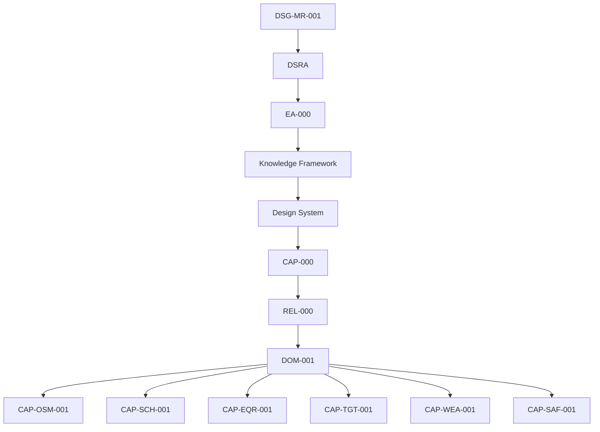

# REV-001 - Core Observatory Readiness Review

| Field | Value |
|---|---|
| Review ID | `REV-001` |
| Review | Core Observatory Readiness Review |
| Role | Architecture Review Board |
| Status | Independent Governance Review - Reassessed |
| Date | 2026-07-27 |
| Scope | Core Observatory Domain only |
| Decision | READY FOR IMPLEMENTATION |
| Evidence basis | Repository evidence only |

## Executive Summary

The Architecture Review Board reassessed the Core Observatory domain using repository evidence only.

The original review identified a condition: `CAP-SAF-001` Observatory Safety was referenced as a future/pending capability and did not yet have a dedicated package. Repository evidence now includes a complete `CAP-SAF-001` capability package, and `CAP-000` / `DOM-001` have been synchronized to include Observatory Safety as `Documented` and `Implementation Ready`.

The Core Observatory domain is now `READY FOR IMPLEMENTATION` for the documented capability scope:

- `CAP-OSM-001` Observation Session Management;
- `CAP-SCH-001` Observation Scheduling;
- `CAP-EQR-001` Equipment Registry;
- `CAP-TGT-001` Target Registry;
- `CAP-WEA-001` Weather Monitoring;
- `CAP-SAF-001` Observatory Safety.

This review does not certify operational release, production readiness or implemented software. It certifies that the domain has sufficient governed documentation evidence to enter implementation.

## Review Scope

This review assesses only the Core Observatory Domain.

In scope:

- `DOM-001` Core Observatory Domain Blueprint;
- `CAP-OSM-001` Observation Session Management;
- `CAP-SCH-001` Observation Scheduling;
- `CAP-EQR-001` Equipment Registry;
- `CAP-TGT-001` Target Registry;
- `CAP-WEA-001` Weather Monitoring;
- `CAP-SAF-001` Observatory Safety;
- `CAP-000` Capability Registry;
- `REL-000` Release Management Baseline.

Out of scope:

- roadmap changes;
- DSRA changes;
- Enterprise Architecture redesign;
- Knowledge Framework redesign;
- Design System redesign;
- new capability definition beyond already registered capability evidence;
- implementation design, code, APIs, database, frontend or backend;
- operational release certification.

## Reviewed Artefacts

| Artefact | Repository path | Evidence used |
|---|---|---|
| `DOM-001` Core Observatory Domain Blueprint | `docs/domains/DOM-001-core-observatory-domain.md` | Domain scope, capability inclusion, dependencies, interfaces, KPI and future evolution. |
| `CAP-000` Capability Registry | `docs/capabilities/CAP-000-capability-registry.md` | Capability status, maturity, readiness, dependencies, coverage and registry statistics. |
| `REL-000` Release Management Baseline | `docs/releases/REL-000-release-management-baseline.md` | Promotion rules, readiness checklist, lifecycle and capability synchronization evidence. |
| `CAP-OSM-001` package | `docs/capabilities/observation-session-management/` | Full capability package and traceability evidence. |
| `CAP-SCH-001` package | `docs/capabilities/observation-scheduling/` | Full capability package and traceability evidence. |
| `CAP-EQR-001` package | `docs/capabilities/equipment-registry/` | Full capability package and traceability evidence. |
| `CAP-TGT-001` package | `docs/capabilities/target-registry/` | Full capability package and traceability evidence. |
| `CAP-WEA-001` package | `docs/capabilities/weather-monitoring/` | Full capability package and traceability evidence. |
| `CAP-SAF-001` package | `docs/capabilities/observatory-safety/` | Full capability package and traceability evidence. |

## Governance Assessment

| Governance Reference | Assessment | Evidence |
|---|---|---|
| Roadmap | Conformant | Capability traceability documents reference `DSG-MR-001`; no roadmap change is introduced. |
| DSRA | Conformant | Safety package references DSRA and defines fail-safe conceptual behavior without implementation. |
| `EA-000` | Conformant | Packages reference Enterprise Architecture layers and do not redefine EA baseline. |
| Knowledge Framework | Conformant | Packages reference domain, information, quality and traceability concepts. |
| Design System | Conformant | No UI implementation is introduced; future UI remains governed by `DSG-DS-001`. |
| Capability Registry | Conformant | `CAP-000` registers all six included domain packages as `Implementation Ready`. |
| Release Management | Conformant | `REL-000` promotion rules are satisfied by complete documentation artefact coverage. |

## Capability Coverage

| Capability | Registry Evidence | Package Evidence | Review Assessment |
|---|---|---|---|
| Observation Session Management | `Implementation Ready` in `CAP-000` | Full package with ADR, SOP, runbooks, manual, test, acceptance and traceability. | Covered for implementation start. |
| Observation Scheduling | `Implementation Ready` in `CAP-000` | Full package with 32 requirements and complete coverage statement. | Covered for implementation start. |
| Equipment Registry | `Implementation Ready` in `CAP-000` | Full package with 32 requirements and complete coverage statement. | Covered for implementation start. |
| Target Registry | `Implementation Ready` in `CAP-000` | Full package with 32 requirements and complete coverage statement. | Covered for implementation start. |
| Weather Monitoring | `Implementation Ready` in `CAP-000` | Full package with 32 requirements, 2 ADR, 4 SOP, 4 runbooks and traceability. | Covered for implementation start. |
| Observatory Safety | `Implementation Ready` in `CAP-000` | Full package with 32 requirements, 2 ADR, 4 SOP, 4 runbooks and traceability. | Covered for implementation start. |

## Documentation Completeness

| Documentation Area | Evidence | Assessment |
|---|---|---|
| Requirements | All six reviewed packages include requirements. Scheduling, Equipment, Target, Weather and Safety each record 32 requirements. | Complete for reviewed packages. |
| ADR | Each reviewed package includes capability ADR evidence. | Complete for reviewed packages. |
| SOP | Each reviewed package includes SOP evidence. | Complete for reviewed packages. |
| Runbooks | Each reviewed package includes runbook evidence. | Complete for reviewed packages. |
| Technical Manuals | Each reviewed package includes `technical-manual.md`. | Complete for reviewed packages. |
| Acceptance Criteria | Each reviewed package includes `acceptance-criteria.md`. | Complete for reviewed packages. |
| Test Plans | Each reviewed package includes `test-plan.md`. | Complete for reviewed packages. |
| Traceability | Each reviewed package includes `traceability.md`; `CAP-000` reports 6 / 21 dedicated packages and 0 duplicate capability identifiers. | Complete for reviewed packages. |

## Traceability Assessment

Traceability is present from the governance chain to each included package. Package traceability matrices reference roadmap, DSRA, Enterprise Architecture, Knowledge Framework, `CAP-000` and `REL-000`. `CAP-SAF-001` additionally references `REV-001` as the review condition it closes.

Remaining traceability improvement items are not blockers for implementation start:

| Gap | Evidence | Impact |
|---|---|---|
| Precise DSRA subsection anchors are not consistently duplicated in every capability matrix. | OSM traceability lists `OSM-TRC-OPEN-001`. | Improve before release validation where repository anchors exist. |
| Future implementation artefacts do not yet exist. | Capability coverage statements indicate operational implementation remains future release scope. | Expected at implementation-readiness stage. |

## Architecture Consistency

| Area | Assessment | Evidence |
|---|---|---|
| Capability boundaries | Consistent | `DOM-001` maps target, equipment, weather, safety, scheduling and session responsibilities. |
| Dependencies | Consistent | `DOM-001` collaboration and information-flow diagrams align with `CAP-000` dependency map. |
| Cross references | Consistent | Capability traceability documents reference upstream governance and peer capability relationships. |
| Domain alignment | Consistent | `DOM-001` includes six documented Core Observatory packages and excludes Acquisition, Data Platform, Knowledge and Experience internals. |
| Implementation boundary | Consistent | Review evidence remains documentation-only and does not define code, APIs, database, frontend, backend, hardware or PLC logic. |

## Risks

Repository-supported risks only:

| Risk | Repository Evidence | Review Impact |
|---|---|---|
| Open scheduling priority model | Scheduling traceability lists final scheduling priority scoring model as open. | Must be resolved before implementing deterministic scheduling behavior. |
| Open equipment identifier and storage model | Equipment traceability lists identifier format and physical storage model as open. | Must be resolved before affected implementation choices. |
| Open target identity/storage/import decisions | Target traceability lists target identifier, physical storage, catalogue import and moving target ephemeris handling as open. | Must be resolved before affected implementation slices. |
| Open weather thresholds/arbitration/retention | Weather traceability lists thresholds, arbitration, publication interface and retention as open. | Must be resolved before weather safety implementation or release. |
| Open safety policy decisions | Safety traceability lists rule priority, policy versioning, freshness, override and audit retention as open. | Must be resolved before affected safety implementation or release gate. |
| DSRA subsection precision gap | OSM traceability records exact DSRA subsection identifiers are not duplicated. | Should be improved before release validation. |

## Open Decisions

| Source | Open Decision |
|---|---|
| OSM Traceability | Exact DSRA subsection identifiers; future implementation artefacts. |
| Observation Scheduling | Final scheduling priority scoring model; schedule evidence retention period; future scheduling UI surface; automated notification behavior. |
| Equipment Registry | Final equipment identifier format; physical storage model; automated telemetry ingestion; detailed compatibility matrix. |
| Target Registry | Final target identifier format; physical storage model; automated catalogue import; moving target ephemeris handling. |
| Weather Monitoring | Final weather thresholds; multi-source arbitration; state publication interface; historical retention. |
| Observatory Safety | Safety rule priority model; safety policy versioning; decision freshness; operator override policy; audit retention class. |

## Findings

### Conformities

| ID | Finding | Evidence |
|---|---|---|
| `REV-001-CON-001` | Core Observatory has a documented domain blueprint. | `DOM-001`. |
| `REV-001-CON-002` | Six included Core Observatory capability packages are documented and marked `Implementation Ready`. | `CAP-000`, `DOM-001`. |
| `REV-001-CON-003` | Required documentation artefacts exist for reviewed packages. | Capability package folders and traceability matrices. |
| `REV-001-CON-004` | Governance chain is preserved. | `DOM-001`, `CAP-000`, `REL-000`, capability traceability matrices. |
| `REV-001-CON-005` | No reviewed artefact introduces implementation code or new architecture in this review. | Scope and package statements. |
| `REV-001-CON-006` | Prior Observatory Safety pending condition is closed by repository evidence. | `docs/capabilities/observatory-safety/`, `CAP-000`, `DOM-001`. |

### Observations

| ID | Finding | Evidence |
|---|---|---|
| `REV-001-OBS-001` | Several implementation-shaping decisions remain open and are correctly recorded as open. | Capability traceability and ADR documents. |
| `REV-001-OBS-002` | Release readiness remains separate from implementation readiness. | `REL-000`, capability coverage statements. |
| `REV-001-OBS-003` | Safety package defines policy authority and fail-safe behavior conceptually; hardware and PLC logic remain out of scope. | `CAP-SAF-001` documents. |

### Non-Conformities

| ID | Finding | Evidence | Severity |
|---|---|---|---|
| None | No repository-supported non-conformity was identified for starting implementation of the documented Core Observatory domain. | Reviewed artefacts. | N/A |

## Readiness Decision

`READY FOR IMPLEMENTATION`

Justification:

- `DOM-001` consolidates all six reviewed Core Observatory capabilities.
- `CAP-000` records all six included capabilities as `Implementation Ready`.
- Capability packages contain requirements, ADR, SOP, runbooks, technical manuals, test plans, acceptance criteria and traceability.
- `CAP-SAF-001` resolves the prior readiness condition around Observatory Safety.
- Open decisions are recorded and governable through existing ADR/release controls.

## Conditions

None.

## Recommendations

- Use the six documented packages as the initial Core Observatory implementation boundary.
- Resolve capability-specific open decisions before implementing the affected behavior or passing release gates.
- Keep implementation tasks linked back to package requirements, ADR, SOP, test plans and acceptance criteria.
- Preserve `REL-000` promotion gates; do not mark any capability operational until implementation, validation and release evidence exist.

## Approval

| Role | Name | Date | Decision | Signature |
|---|---|---|---|---|
| Architecture Review Board |  |  |  |  |
| Chair |  |  |  |  |
| Reviewer |  |  |  |  |
