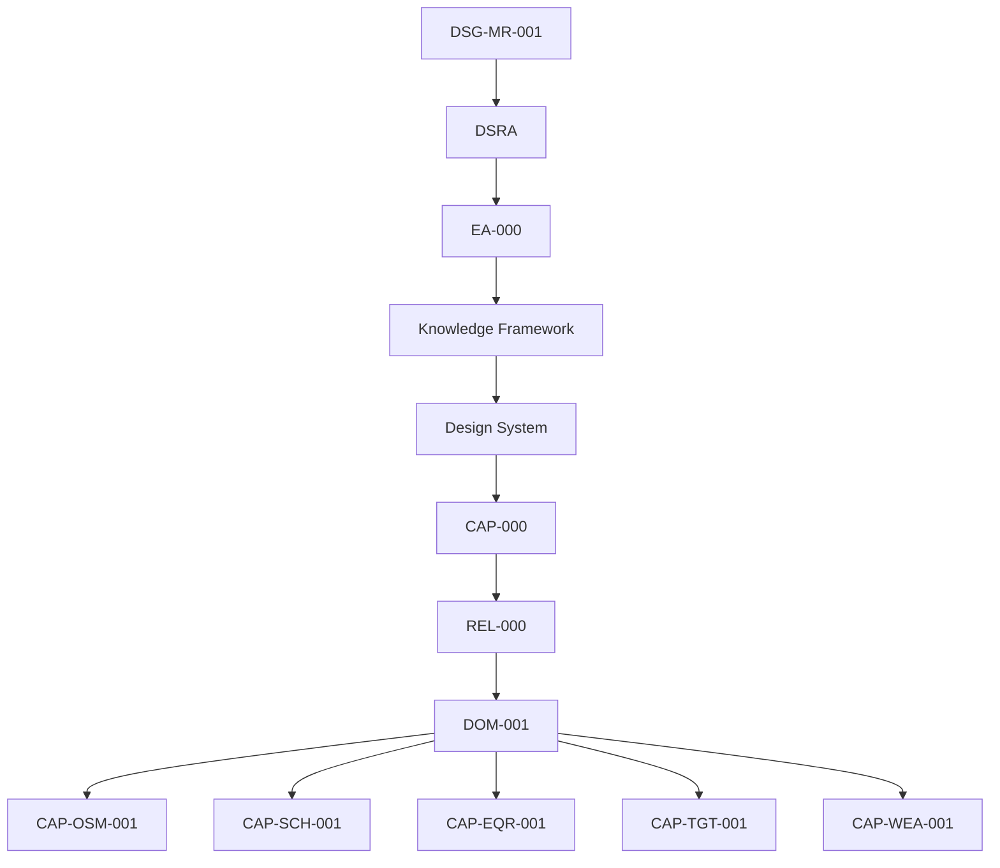

# REV-001 - Core Observatory Readiness Review

| Field | Value |
|---|---|
| Review ID | `REV-001` |
| Review | Core Observatory Readiness Review |
| Role | Architecture Review Board |
| Status | Independent Governance Review |
| Date | 2026-07-27 |
| Scope | Core Observatory Domain only |
| Decision | READY WITH CONDITIONS |
| Evidence basis | Repository evidence only |

## Executive Summary

The Architecture Review Board assessed the Core Observatory domain using repository evidence only. The reviewed evidence shows that `DOM-001` consolidates five documented Core Observatory capability packages:

- `CAP-OSM-001` Observation Session Management;
- `CAP-SCH-001` Observation Scheduling;
- `CAP-EQR-001` Equipment Registry;
- `CAP-TGT-001` Target Registry;
- `CAP-WEA-001` Weather Monitoring.

`CAP-000` marks all five included capability packages as `Implementation Ready`. Each package contains the expected documentation set: overview, business process, requirements, architecture mapping, conceptual data model, ADR, SOP, runbooks, technical manual, test plan, acceptance criteria and traceability.

The review decision is `READY WITH CONDITIONS`. The documented Core Observatory scope is ready to enter software implementation, provided implementation remains limited to the five documented capability packages and open decisions are resolved before the affected implementation or release gate. `CAP-SAF-001` Observatory Safety remains pending as a dedicated capability package and shall not be treated as implemented or complete by this review.

## Review Scope

This review assesses only the Core Observatory Domain.

In scope:

- `DOM-001` Core Observatory Domain Blueprint;
- `CAP-OSM-001` Observation Session Management;
- `CAP-SCH-001` Observation Scheduling;
- `CAP-EQR-001` Equipment Registry;
- `CAP-TGT-001` Target Registry;
- `CAP-WEA-001` Weather Monitoring;
- `CAP-000` Capability Registry;
- `REL-000` Release Management Baseline.

Out of scope:

- roadmap changes;
- DSRA changes;
- Enterprise Architecture redesign;
- Knowledge Framework redesign;
- Design System redesign;
- new capability definition;
- implementation design, code, APIs, database, frontend or backend;
- operational release certification.

## Reviewed Artefacts

| Artefact | Repository path | Evidence used |
|---|---|---|
| `DOM-001` Core Observatory Domain Blueprint | `docs/domains/DOM-001-core-observatory-domain.md` | Domain scope, capability inclusion, dependencies, interfaces, KPI and future evolution. |
| `CAP-000` Capability Registry | `docs/capabilities/CAP-000-capability-registry.md` | Capability status, maturity, readiness, dependencies, coverage and registry statistics. |
| `REL-000` Release Management Baseline | `docs/releases/REL-000-release-management-baseline.md` | Promotion rules, readiness checklist, lifecycle and capability synchronization evidence. |
| OSM Overview | `docs/capabilities/observation-session-management/index.md` | Capability baseline. |
| OSM Business Process | `docs/capabilities/observation-session-management/business-process.md` | Process evidence. |
| OSM Requirements | `docs/capabilities/observation-session-management/requirements.md` | Requirement evidence. |
| OSM Architecture Mapping | `docs/capabilities/observation-session-management/architecture-mapping.md` | Architecture alignment. |
| OSM Data Model | `docs/capabilities/observation-session-management/data-model.md` | Conceptual data evidence. |
| OSM ADR | `docs/capabilities/observation-session-management/adr/OSM-ADR-001-session-governance-boundary.md` | Decision evidence. |
| OSM ADR | `docs/capabilities/observation-session-management/adr/OSM-ADR-002-session-manifest-evidence-binder.md` | Decision evidence. |
| OSM SOP | `docs/capabilities/observation-session-management/sop/prepare-session.md` | Procedure evidence. |
| OSM SOP | `docs/capabilities/observation-session-management/sop/execute-session.md` | Procedure evidence. |
| OSM SOP | `docs/capabilities/observation-session-management/sop/abort-session.md` | Procedure evidence. |
| OSM SOP | `docs/capabilities/observation-session-management/sop/recover-session.md` | Procedure evidence. |
| OSM SOP | `docs/capabilities/observation-session-management/sop/close-session.md` | Procedure evidence. |
| OSM Runbooks | `docs/capabilities/observation-session-management/runbooks/` | Failure and recovery evidence. |
| OSM Technical Manual | `docs/capabilities/observation-session-management/technical-manual.md` | Manual evidence. |
| OSM Test Plan | `docs/capabilities/observation-session-management/test-plan.md` | Test evidence. |
| OSM Acceptance Criteria | `docs/capabilities/observation-session-management/acceptance-criteria.md` | Acceptance evidence. |
| OSM Traceability | `docs/capabilities/observation-session-management/traceability.md` | 24 / 24 mapped documents, 0 orphan capability documents. |
| Scheduling Package | `docs/capabilities/observation-scheduling/` | Full capability package evidence. |
| Scheduling Traceability | `docs/capabilities/observation-scheduling/traceability.md` | Complete readiness coverage statement and open decisions. |
| Equipment Registry Package | `docs/capabilities/equipment-registry/` | Full capability package evidence. |
| Equipment Registry Traceability | `docs/capabilities/equipment-registry/traceability.md` | Complete readiness coverage statement and open decisions. |
| Target Registry Package | `docs/capabilities/target-registry/` | Full capability package evidence. |
| Target Registry Traceability | `docs/capabilities/target-registry/traceability.md` | Complete readiness coverage statement and open decisions. |
| Weather Monitoring Package | `docs/capabilities/weather-monitoring/` | Full capability package evidence. |
| Weather Monitoring Traceability | `docs/capabilities/weather-monitoring/traceability.md` | Artefact traceability and open decisions. |

## Governance Assessment

| Governance Reference | Assessment | Evidence |
|---|---|---|
| Roadmap | Conformant | Capability traceability documents reference `DSG-MR-001`; no roadmap change is introduced. |
| DSRA | Conformant with open safety dependency | Capability traceability documents reference DSRA; weather and session safety remain tied to DSRA and future Observatory Safety. |
| `EA-000` | Conformant | Packages reference Enterprise Architecture layers and do not redefine EA baseline. |
| Knowledge Framework | Conformant | Packages reference domain model, canonical information model, quality model and traceability concepts. |
| Design System | Conformant | No UI implementation is introduced; future UI surfaces remain governed by `DSG-DS-001`. |
| Capability Registry | Conformant | `CAP-000` registers the five included domain packages as `Implementation Ready`. |
| Release Management | Conformant | `REL-000` defines the evidence needed for `Implementation Ready`; the five packages satisfy documented artefact coverage. |

## Capability Coverage

| Capability | Registry Evidence | Package Evidence | Review Assessment |
|---|---|---|---|
| Observation Session Management | `Implementation Ready` in `CAP-000` | Full package with ADR, SOP, runbooks, manual, test, acceptance and traceability. | Covered for implementation start. |
| Observation Scheduling | `Implementation Ready` in `CAP-000` | Full package with 32 requirements and complete coverage statement. | Covered for implementation start. |
| Equipment Registry | `Implementation Ready` in `CAP-000` | Full package with 32 requirements and complete coverage statement. | Covered for implementation start. |
| Target Registry | `Implementation Ready` in `CAP-000` | Full package with 32 requirements and complete coverage statement. | Covered for implementation start. |
| Weather Monitoring | `Implementation Ready` in `CAP-000` | Full package with 32 requirements, 2 ADR, 4 SOP, 4 runbooks and traceability. | Covered for implementation start. |
| Observatory Safety | `Architecture Complete` in `CAP-000`; future extension in `DOM-001` | No dedicated `CAP-SAF-001` package reviewed. | Pending. Not certified by this review as an implemented or implementation-ready package. |

## Documentation Completeness

| Documentation Area | Evidence | Assessment |
|---|---|---|
| Requirements | OSM, Scheduling, Equipment, Target and Weather packages include requirements. Scheduling, Equipment, Target and Weather each record 32 requirements. | Complete for reviewed packages. |
| ADR | OSM includes 2 capability ADRs plus architecture ADR relationship; Scheduling, Equipment, Target and Weather include 2 capability ADRs each. | Complete for reviewed packages. |
| SOP | OSM includes 5 SOP; Scheduling, Equipment, Target and Weather include 4 SOP each. | Complete for reviewed packages. |
| Runbooks | OSM includes 8 runbooks; Scheduling, Equipment, Target and Weather include 4 runbooks each. | Complete for reviewed packages. |
| Technical Manuals | Each reviewed package includes `technical-manual.md`. | Complete for reviewed packages. |
| Acceptance Criteria | Each reviewed package includes `acceptance-criteria.md`. | Complete for reviewed packages. |
| Test Plans | Each reviewed package includes `test-plan.md`. | Complete for reviewed packages. |
| Traceability | Each reviewed package includes `traceability.md`; CAP-000 reports 5 / 21 dedicated packages and 0 duplicate capability identifiers. | Complete for reviewed packages. |

## Traceability Assessment

Traceability is present from the governance chain to each included package. Package traceability matrices reference roadmap, DSRA, Enterprise Architecture, Knowledge Framework, `CAP-000` and `REL-000`.

Gaps:

| Gap | Evidence | Impact |
|---|---|---|
| Precise DSRA subsection anchors are not consistently duplicated in every capability matrix. | OSM traceability lists `OSM-TRC-OPEN-001`. | Does not block implementation start, but should be improved before release validation. |
| Future implementation artefacts do not yet exist. | OSM traceability lists `OSM-TRC-OPEN-002`; packages state operational implementation remains future release scope. | Expected at readiness-review stage; not a non-conformity. |
| `CAP-SAF-001` has no dedicated package. | `CAP-000` marks Observatory Safety `Architecture Complete`; `DOM-001` lists it as future evolution. | Safety automation or dedicated safety implementation cannot be certified by this review. |

## Architecture Consistency

| Area | Assessment | Evidence |
|---|---|---|
| Capability boundaries | Consistent | `DOM-001` states no redesign and maps distinct target, equipment, weather, scheduling and session responsibilities. |
| Dependencies | Consistent | `DOM-001` collaboration and information-flow diagrams align with `CAP-000` dependency map. |
| Cross references | Consistent | Capability traceability documents reference upstream governance and peer capability relationships. |
| Domain alignment | Consistent | `DOM-001` includes five documented Core Observatory packages and excludes Acquisition, Data Platform, Knowledge and Experience internals. |
| Implementation boundary | Consistent | Review evidence remains documentation-only and does not define code, APIs, database, frontend or backend. |

## Risks

Repository-supported risks only:

| Risk | Repository Evidence | Review Impact |
|---|---|---|
| Observatory Safety package pending | `CAP-000` marks `CAP-SAF-001` as `Architecture Complete`; `DOM-001` lists it as future evolution. | Conditions required for implementation scope and safety automation boundary. |
| Open scheduling priority model | Scheduling traceability lists final scheduling priority scoring model as open. | Must be resolved before implementing deterministic scheduling behavior. |
| Open equipment identifier and storage model | Equipment traceability lists identifier format and physical storage model as open. | Must be resolved before implementation choices depend on identifiers/storage. |
| Open target identity/storage/import decisions | Target traceability lists target identifier, physical storage, catalogue import and moving target ephemeris handling as open. | Must be resolved before affected implementation slices. |
| Open weather thresholds/arbitration/retention | Weather traceability lists thresholds, arbitration, publication interface and retention as open. | Must be resolved before weather safety implementation or release. |
| DSRA subsection precision gap | OSM traceability records exact DSRA subsection identifiers are not duplicated. | Should be improved before release validation. |

## Open Decisions

| Source | Open Decision |
|---|---|
| OSM Traceability | Exact DSRA subsection identifiers; future implementation artefacts. |
| Observation Scheduling | Final scheduling priority scoring model; schedule evidence retention period; future scheduling UI surface; automated notification behavior. |
| Equipment Registry | Final equipment identifier format; physical storage model; automated telemetry ingestion; detailed compatibility matrix. |
| Target Registry | Final target identifier format; physical storage model; automated catalogue import; moving target ephemeris handling. |
| Weather Monitoring | Final weather thresholds; multi-source arbitration; state publication interface; historical retention. |
| CAP-000 / DOM-001 | Dedicated Observatory Safety capability package remains future work. |

## Findings

### Conformities

| ID | Finding | Evidence |
|---|---|---|
| `REV-001-CON-001` | Core Observatory has a documented domain blueprint. | `DOM-001`. |
| `REV-001-CON-002` | Five included Core Observatory capability packages are documented and marked `Implementation Ready`. | `CAP-000`, `DOM-001`. |
| `REV-001-CON-003` | Required documentation artefacts exist for reviewed packages. | Capability package folders and traceability matrices. |
| `REV-001-CON-004` | Governance chain is preserved. | `DOM-001`, `CAP-000`, `REL-000`, capability traceability matrices. |
| `REV-001-CON-005` | No reviewed artefact introduces implementation code or new architecture in this review. | Scope and package statements. |

### Observations

| ID | Finding | Evidence |
|---|---|---|
| `REV-001-OBS-001` | Observatory Safety is referenced as dependency/future extension but has no reviewed dedicated package. | `CAP-000`, `DOM-001`. |
| `REV-001-OBS-002` | Several implementation-shaping decisions remain open and are correctly recorded as open. | Capability traceability and ADR documents. |
| `REV-001-OBS-003` | Release readiness is documentation-based; operational readiness is not claimed. | `REL-000`, capability coverage statements. |

### Non-Conformities

| ID | Finding | Evidence | Severity |
|---|---|---|---|
| None | No repository-supported non-conformity was identified for starting implementation of the five documented Core Observatory packages. | Reviewed artefacts. | N/A |

## Readiness Decision

`READY WITH CONDITIONS`

Justification:

- `DOM-001` consolidates the five reviewed Core Observatory capabilities.
- `CAP-000` records those five capabilities as `Implementation Ready`.
- Capability packages contain requirements, ADR, SOP, runbooks, technical manuals, test plans, acceptance criteria and traceability.
- Open decisions are recorded and therefore governable.
- `CAP-SAF-001` Observatory Safety remains pending as a dedicated package and cannot be certified by this review.

## Conditions

| ID | Condition | Minimum Action | Required Before |
|---|---|---|---|
| `REV-001-CND-001` | Implementation scope shall be limited to the five documented packages reviewed here. | Do not treat `CAP-SAF-001` or other non-packaged capabilities as implementation-ready under this review. | Software implementation start. |
| `REV-001-CND-002` | Capability-specific open decisions shall be resolved before affected implementation slices or release gates. | Use existing ADR/open decision governance; do not infer missing values. | Relevant implementation/release gate. |
| `REV-001-CND-003` | Safety automation or broader Observatory Safety behavior shall wait for a dedicated `CAP-SAF-001` package or approved governance path. | Keep safety dependency explicit and bounded. | Any safety-specific implementation. |
| `REV-001-CND-004` | DSRA reference precision should be improved where capability traceability records it as open. | Add precise anchors only when supported by repository structure. | Release validation, not implementation start. |

## Recommendations

- Use the five documented packages as the initial Core Observatory implementation backlog boundary.
- Sequence implementation so registry-like capabilities (`CAP-TGT-001`, `CAP-EQR-001`, `CAP-WEA-001`) support scheduling and session management decisions.
- Keep all implementation tasks linked back to package requirements, ADR, SOP, test plans and acceptance criteria.
- Create a separate readiness review for Observatory Safety after `CAP-SAF-001` has a dedicated package.
- Preserve `REL-000` promotion gates; do not mark any capability operational until implementation, validation and release evidence exist.

## Approval

| Role | Name | Date | Decision | Signature |
|---|---|---|---|---|
| Architecture Review Board |  |  |  |  |
| Chair |  |  |  |  |
| Reviewer |  |  |  |  |
