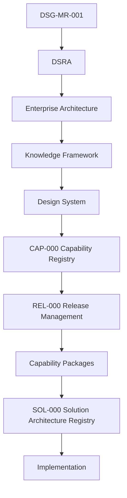

# SOL-000 - Solution Architecture Registry

| Campo | Valore |
|---|---|
| Documento | Solution Architecture Registry |
| ID | `SOL-000` |
| Stato | Official Solution Architecture Registry |
| Versione | 0.1 |
| Data | 2026-07-27 |
| Owner | Lead Solution Architect / Repository Manager |
| Fonte gerarchica | `DSG-MR-001` -> DSRA -> Enterprise Architecture -> Knowledge Framework -> Design System -> `CAP-000` -> `REL-000` -> Capability Packages -> Solution Architecture |
| Ambito | Solution package supportati da capability documentate e approvate |

## Purpose

`SOL-000` is the authoritative registry of implementation-oriented Solution Architecture packages for Digital StarGate. It records solution identity, maturity, implementation readiness, governing capability and evidence status without introducing a new governance framework.

A solution package describes **how** one or more approved capabilities can be realised in the Digital StarGate environment. It does not replace capability requirements and does not claim that implementation evidence exists.

## Architectural Position



## Registry Rules

- A solution SHALL reference at least one governed capability package.
- A solution SHALL remain subordinate to Enterprise Architecture and capability decisions.
- Solution status SHALL distinguish design evidence from implementation evidence.
- Existing products, proposed logical components and external dependencies SHALL be identified separately.
- Unverified interfaces or component details SHALL be marked `TBD` or `Pending Technical Validation`.
- A solution SHALL NOT be classified as implemented without repository evidence.
- Safety-related orchestration SHALL remain constrained by `CAP-SAF-001`.

## Identifier Convention

Solution identifiers use:

```text
SOL-<DOMAIN>-<NUMBER>
```

| Element | Meaning |
|---|---|
| `SOL` | Governed Solution Architecture package |
| `<DOMAIN>` | Capability or solution-domain prefix |
| `<NUMBER>` | Three-digit sequence |

Example: `SOL-OSM-001`.

## Maturity Model

| Maturity | Meaning |
|---|---|
| Registered | Identifier and scope recorded; package not yet complete. |
| Solution Designed | Logical solution, assumptions and architectural boundaries documented. |
| Technically Validated | Interfaces and deployment assumptions verified against the real environment. |
| Implementation Ready | Detailed design, verification plan and unresolved decisions are sufficient to start implementation. |
| Implemented | Implementation evidence exists in the repository. |
| Operational | Validated evidence demonstrates controlled operational use. |

## Implementation Readiness

| Readiness | Meaning |
|---|---|
| Not Ready | Scope or governing requirements are incomplete. |
| Ready for Technical Validation | Solution design exists; real interfaces and deployment details require verification. |
| Ready for Implementation Planning | Technical validation is complete and implementation work can be planned. |
| Ready for Implementation | Design, controls, tests and rollback are complete enough for controlled implementation. |
| Operational | The solution is implemented, accepted and supported by operational evidence. |

## Solution Registry

| ID | Solution | Governing capability | Status | Maturity | Implementation readiness | Version | Evidence |
|---|---|---|---|---|---|---|---|
| `SOL-OSM-001` | Observation Session Management Solution Architecture | `CAP-OSM-001` | Documented | Solution Designed | Ready for Technical Validation | 0.1 | [Solution package](observation-session-management/index.md) |

## Dependency Summary

`SOL-OSM-001` consumes governed information and authorisation from:

- `CAP-SCH-001` - Observation Scheduling;
- `CAP-EQR-001` - Equipment Registry;
- `CAP-TGT-001` - Target Registry;
- `CAP-WEA-001` - Weather Monitoring;
- `CAP-SAF-001` - Observatory Safety.

## Governance and Change Control

Changes to a solution package SHALL:

1. preserve the governing capability identifiers;
2. identify affected interfaces, states and evidence;
3. record open decisions rather than invent unsupported implementation details;
4. update this registry when status, maturity, readiness or version changes;
5. pass `mkdocs build --strict` before merge or publication.
