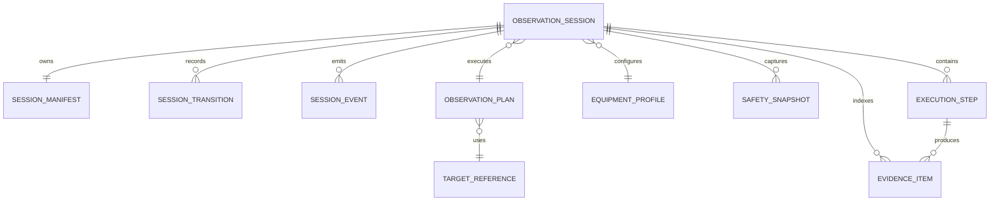

# SOL-OSM-001 — Data Model

## 1. Purpose

The data model defines the minimum information required to govern an observation session and preserve traceability across planning, execution, safety and evidence.

## 2. Core entities

## 3. Entity definitions

### 3.1 ObservationSession

| Field | Type | Notes |
|---|---|---|
| `session_id` | string | Immutable unique identifier |
| `status` | enum | Current canonical state |
| `created_at` | datetime | ISO 8601 with timezone |
| `planned_start` | datetime | Optional planned start |
| `actual_start` | datetime | Set on execution start |
| `actual_end` | datetime | Set before closure |
| `operator_id` | string | Account or service identity |
| `plan_id` | string | Reference to observation plan |
| `equipment_profile_id` | string | Reference to validated profile |
| `policy_version` | string | Policy applied to the session |

### 3.2 SessionManifest

The manifest is the evidence binder for the session. It records references, checksums, decisions and final outcome rather than duplicating every source artefact.

### 3.3 SafetySnapshot

| Field | Type | Notes |
|---|---|---|
| `snapshot_id` | string | Unique identifier |
| `session_id` | string | Parent session |
| `captured_at` | datetime | Source timestamp |
| `state` | enum | `SAFE`, `UNSAFE`, `UNKNOWN` |
| `source` | string | Authoritative source identifier |
| `reason_codes` | array | Conditions affecting state |
| `raw_evidence_ref` | string | Optional source payload reference |

### 3.4 EvidenceItem

| Field | Type | Notes |
|---|---|---|
| `evidence_id` | string | Unique identifier |
| `type` | enum | log, image, report, telemetry, command, response |
| `uri` | string | Local or remote location |
| `sha256` | string | Integrity checksum where applicable |
| `created_at` | datetime | Artefact timestamp |
| `producer` | string | Component that produced it |
| `retention_class` | string | Retention policy identifier |

## 4. Persistence rules

- Identifiers are immutable.
- Timestamps include timezone information.
- State transitions are append-only.
- Corrections are represented as new records, never destructive updates.
- Evidence checksums are calculated before remote synchronization.
- Sensitive values such as credentials are never stored in the session manifest.
