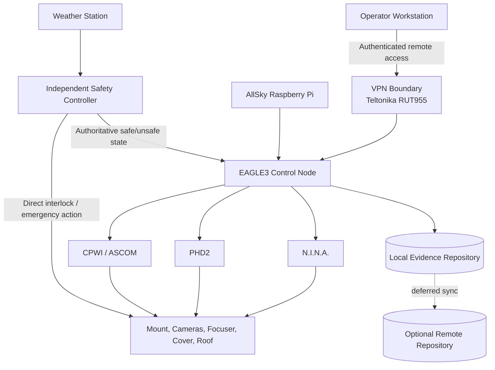

# SOL-OSM-001 — Deployment Architecture

## 1. Purpose

This document defines the target deployment view for the Observation Session Management solution. It translates the logical components of SOL-OSM-001 into deployable nodes while preserving the authority boundaries defined by CAP-OSM-001.

## 2. Deployment principles

1. Safety authority remains independent from the session orchestration logic.
2. Equipment control is mediated through validated adapters and existing device-control software.
3. Session evidence is persisted locally before any optional remote synchronization.
4. Loss of Internet connectivity must not make the observatory unsafe.
5. Remote operation must use authenticated, encrypted access through the existing VPN boundary.

## 3. Target nodes

| Node | Primary responsibility | Typical technology | Criticality |
|---|---|---|---|
| Operator workstation | Planning, supervision and manual intervention | Browser or desktop client | Medium |
| EAGLE3 control node | Session orchestration and local integrations | Windows, N.I.N.A., PHD2, CPWI, ASCOM | High |
| Safety controller | Roof, interlocks and emergency actions | Independent controller/RTU | Safety-critical |
| Weather node | Weather and sky-condition acquisition | Weather station and AllSky Raspberry Pi | High |
| Local evidence repository | Session manifests, events, logs and artefacts | Local filesystem or embedded database | High |
| Network gateway | VPN and WAN failover | Teltonika RUT955, Starlink, LTE | High |
| Optional remote repository | Backup, analytics and long-term evidence | Remote storage or future platform service | Medium |

## 4. Deployment diagram

## 5. Availability model

The minimum safe operating configuration consists of:

- the safety controller;
- roof and equipment interlocks;
- local power and control paths;
- local storage for evidence;
- the EAGLE3 node when an observation session is active.

Remote services, Internet connectivity and remote repositories are not part of the minimum safety path.

## 6. Failure containment

| Failure | Required containment |
|---|---|
| Internet outage | Continue locally or close safely; preserve evidence locally |
| VPN outage | No new remote commands; local automation remains governed |
| EAGLE3 failure | Independent safety controller retains authority |
| N.I.N.A. failure | Orchestrator records failure and triggers recovery/abort policy |
| Weather data unavailable | Treat as unknown; policy determines conservative transition |
| Local repository unavailable | Prevent normal session closure until evidence is recovered or explicitly waived |

## 7. Deployment validation

The deployment view is ready for implementation when:

- each node has an identified owner;
- safety paths are validated independently from orchestration;
- network ports and trust boundaries are documented;
- backup and restore procedures are tested;
- local operation during WAN loss is demonstrated.
