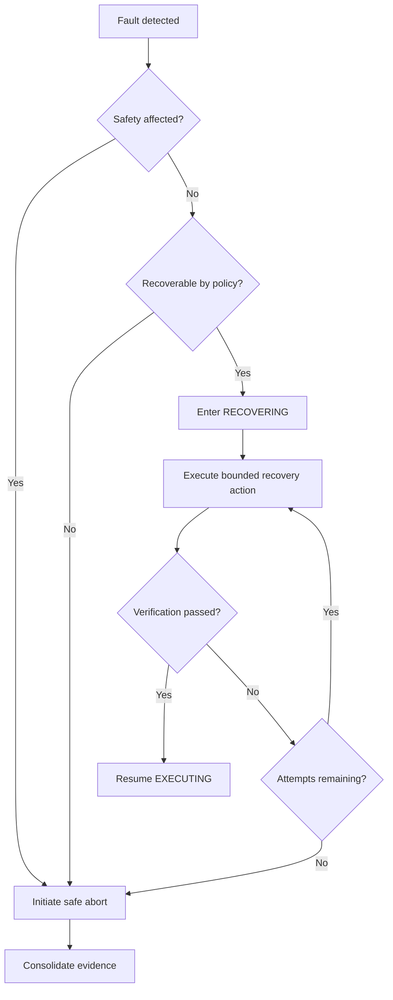

# SOL-OSM-001 — Error Handling and Recovery

## 1. Error taxonomy

| Category | Example | Default response |
|---|---|---|
| Validation error | Missing equipment profile | Reject readiness |
| Transient integration error | Temporary adapter timeout | Bounded retry |
| Recoverable execution error | Guiding lost | Enter `RECOVERING` |
| Safety error | Weather becomes unsafe | Enter `ABORTING` and apply safe policy |
| Infrastructure error | Local storage unavailable | Pause or abort according to evidence policy |
| Irrecoverable equipment error | Mount unavailable | Abort and close with failure evidence |

## 2. Recovery policy

A recovery attempt must define:

- maximum number of attempts;
- maximum recovery duration;
- verification check after each action;
- fallback transition;
- operator notification threshold.

## 3. Recovery flow

## 4. Examples

### 4.1 Guiding loss

1. Record loss event and guiding diagnostics.
2. Pause imaging when required.
3. Attempt guide-star reacquisition within policy limits.
4. Verify guiding stability.
5. Resume or abort.

### 4.2 N.I.N.A. unavailable

1. Confirm process and API state.
2. Avoid duplicate start commands.
3. Attempt controlled reconnection.
4. Verify sequence ownership and current equipment state.
5. Resume only after state reconciliation.

### 4.3 Unsafe weather

No normal recovery attempt overrides an authoritative `UNSAFE` state. The solution applies the safe-response policy and waits for a separately governed future session or resume decision.
