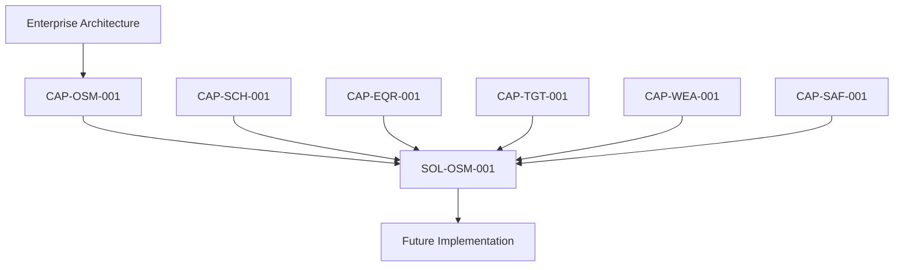

# SOL-OSM-001 - Observation Session Management Solution Architecture

| Campo | Valore |
|---|---|
| Documento | Observation Session Management Solution Architecture |
| ID | `SOL-OSM-001` |
| Stato | Documented |
| Maturita | Solution Designed |
| Implementation Readiness | Ready for Technical Validation |
| Versione | 0.1 |
| Data | 2026-07-27 |
| Owner | Lead Solution Architect |
| Governing capability | `CAP-OSM-001` |
| Fonte gerarchica | `DSG-MR-001` -> DSRA -> Enterprise Architecture -> Knowledge Framework -> Design System -> `CAP-000` -> `REL-000` -> Capability Packages -> `SOL-000` |

## Purpose

`SOL-OSM-001` defines the implementation-oriented architecture for realising Observation Session Management in the Digital StarGate observatory environment.

The package translates the approved capability boundary into a target logical solution. It does not implement production software and does not alter the requirements, ownership or governance defined by `CAP-OSM-001`.

## Scope

Included:

- solution boundary for the complete observing-session lifecycle;
- separation between existing observatory products and proposed Digital StarGate logical components;
- logical orchestration responsibilities;
- integration boundaries with scheduling, target, equipment, weather and safety capabilities;
- assumptions, constraints and open technical decisions;
- foundation for later state, interface, data, deployment, security and verification documents.

Excluded from this initial package block:

- production code;
- database implementation;
- API implementation;
- device-driver changes;
- PLC or physical safety logic;
- unattended-operation approval;
- claims that proposed services are already deployed.

## Architectural Position

`SOL-OSM-001` is subordinate to the approved Enterprise Architecture and capability package. It consumes capability outcomes; it does not reproduce their internal business logic.

## Relationship with CAP-OSM-001

`CAP-OSM-001` defines what Observation Session Management must govern. `SOL-OSM-001` defines a candidate technical arrangement for realising that capability.

| Capability concern | Solution response |
|---|---|
| Governed session lifecycle | Explicit orchestration and state-management responsibilities |
| Readiness and preparation | Capability adapters and validation workflow |
| Controlled execution | Session Orchestrator with product-specific adapters |
| Safety constraints | External safety authorisation consumed from `CAP-SAF-001` |
| Traceability | Event, audit and session repositories |
| Recovery and closure | Deterministic workflow paths to be detailed in subsequent package blocks |

## Related Capabilities

| Capability | Relationship |
|---|---|
| `CAP-SCH-001` | Supplies schedule eligibility and planned execution context. |
| `CAP-EQR-001` | Supplies authoritative equipment and configuration references. |
| `CAP-TGT-001` | Supplies authoritative target identity and coordinates. |
| `CAP-WEA-001` | Supplies weather assessments and freshness evidence. |
| `CAP-SAF-001` | Supplies or withdraws safety authorisation and overrides ordinary workflow progression. |

## Implementation Disclaimer

This package is architecture documentation only.

- Existing observatory products are referenced as products, not reimplemented.
- Proposed logical components are not assumed to be separate microservices.
- Interfaces not verified against the operating environment remain `TBD`.
- No component may bypass a safety denial or withdrawn safety authorisation.
- Unattended operation remains out of scope until safety implementation and acceptance evidence exist.

## Document Map

| Document | Purpose |
|---|---|
| [Solution Overview](solution-overview.md) | Current environment, target solution, assumptions, constraints and open decisions. |
| [Logical Architecture](logical-architecture.md) | Logical responsibilities, boundaries and component interactions. |

Planned subsequent documents include requirements realisation, session state model, integration catalogue, data model, failure and recovery, security, observability, deployment, roadmap, verification and traceability.

## Package Status

The initial block establishes the Solution Architecture layer and its first registered package. The package is classified as **Solution Designed** and **Ready for Technical Validation** because interfaces and deployment assumptions have not yet been verified against the active observatory configuration.
