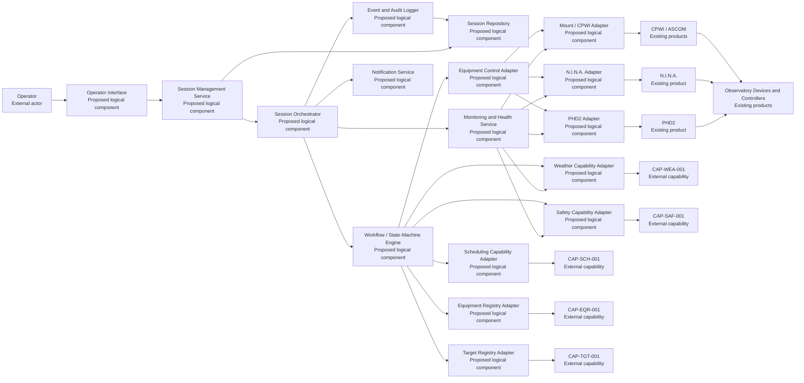
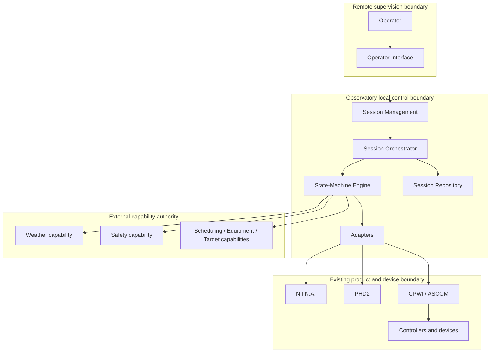

# SOL-OSM-001 - Logical Architecture

## Purpose

This document defines the logical responsibilities required to realise `CAP-OSM-001`. Logical components describe responsibilities and boundaries; they do not imply one process, one host or one microservice per component.

## Classification

| Classification | Meaning |
|---|---|
| Existing Product | A product already present or identified in the observatory environment. |
| Proposed Logical Component | A Digital StarGate responsibility to be implemented or assigned. |
| External Capability/System | An authoritative dependency outside the internal session workflow. |

## Logical Component View

## Core Responsibilities

### Operator Interface

**Classification:** Proposed Logical Component

Provides controlled visibility and commands for session definition, validation, start, pause, resume, abort and closure. It shall display authoritative safety state and shall not permit an operator command to bypass safety denial.

### Session Management Service

**Classification:** Proposed Logical Component

Owns the application-level session record and exposes use cases to the Operator Interface. It coordinates session creation, retrieval, command submission and outcome presentation without embedding product-specific behaviour.

### Session Orchestrator

**Classification:** Proposed Logical Component

Coordinates the end-to-end observing-session workflow. It issues governed intents to the Workflow Engine and adapters, applies timeout and recovery decisions, and records resulting evidence.

The Session Orchestrator does not own weather rules or safety policy.

### Workflow / State-Machine Engine

**Classification:** Proposed Logical Component

Maintains the canonical deterministic state of each session. It validates permitted transitions, associates transitions with events and prevents non-authorised progression. The detailed state model is delivered in a subsequent package block.

### Event and Audit Logger

**Classification:** Proposed Logical Component

Records state transitions, commands, acknowledgements, failures, operator actions, safety decisions and correlation identifiers. Audit records shall be append-oriented and time-correlated.

### Session Repository

**Classification:** Proposed Logical Component

Persists session identity, references, current state, transition history and evidence metadata. The implementation technology is `TBD`. It shall support local continuity during remote connectivity loss.

### Notification Service

**Classification:** Proposed Logical Component

Distributes operational notifications and escalation messages. Channels, severity mapping and delivery guarantees remain open decisions.

### Monitoring and Health Service

**Classification:** Proposed Logical Component

Collects component health, heartbeat, connectivity, data freshness and session-progress metrics. Monitoring informs the orchestrator but does not independently authorise unsafe actions.

## Capability Integration Adapters

### Scheduling Capability Adapter

Consumes eligibility, plan and scheduling references from `CAP-SCH-001`. It shall not recalculate scheduling policy inside the session solution.

### Equipment Registry Adapter

Resolves authoritative equipment profile references from `CAP-EQR-001`. Device-specific connection details may be materialised for execution but remain traceable to the authoritative profile.

### Target Registry Adapter

Resolves target identity and coordinates from `CAP-TGT-001`. It shall not create competing target master data.

### Weather Capability Adapter

Consumes weather assessment, timestamp and freshness evidence from `CAP-WEA-001`. Raw sensor ingestion or threshold ownership remains outside this component unless separately governed.

### Safety Capability Adapter

Consumes safety authorisation, denial and withdrawal from `CAP-SAF-001`. A denial or withdrawal has precedence over ordinary workflow progression.

## Product Integration Adapters

### Equipment Control Adapter

Provides a canonical boundary between the session workflow and product-specific adapters. It normalises command outcomes, acknowledgements, timeout and error categories.

### N.I.N.A. Integration Adapter

Integrates with the existing N.I.N.A. product for imaging-sequence execution and telemetry. The actual mechanism is `TBD` pending version-specific validation.

### PHD2 Integration Adapter

Integrates with the existing PHD2 product for guiding telemetry, state and controlled recovery actions. The actual server or API mechanism is `TBD`.

### Mount / CPWI Integration Adapter

Integrates with CPWI, ASCOM and the mount-control chain. The exact command path, ownership boundaries and acknowledgements require validation.

## Existing Products and Physical Execution

Existing products include N.I.N.A., PHD2, CPWI, ASCOM drivers and observatory device controllers. They execute device-specific operations and expose status where supported.

They are not replaced by `SOL-OSM-001`. The solution wraps them with governed orchestration, state and evidence responsibilities.

## Primary Logical Interactions

| Interaction | Source | Destination | Purpose |
|---|---|---|---|
| Session command | Operator Interface | Session Management Service | Submit governed operator intent |
| Workflow intent | Session Management Service | Session Orchestrator | Begin or alter session lifecycle |
| State transition | Session Orchestrator | Workflow Engine | Request validated transition |
| Schedule validation | Workflow Engine | Scheduling Adapter | Confirm eligibility and plan context |
| Equipment resolution | Workflow Engine | Equipment Registry Adapter | Resolve authoritative configuration references |
| Target resolution | Workflow Engine | Target Registry Adapter | Resolve authoritative target reference |
| Weather assessment | Workflow Engine | Weather Adapter | Obtain current assessment and freshness evidence |
| Safety authorisation | Workflow Engine | Safety Adapter | Obtain or revalidate permission to proceed |
| Equipment command | Workflow Engine | Equipment Control Adapter | Execute controlled operational step |
| Product command/status | Product Adapter | Existing Product | Translate canonical intent to supported mechanism |
| Audit event | All governed components | Event and Audit Logger | Persist traceable evidence |
| Health data | Components and adapters | Monitoring Service | Report availability, freshness and progress |
| Notification | Session Orchestrator | Notification Service | Inform operator or escalation path |

## Trust and Authority Boundaries

Remote supervision may be interrupted. Local workflow, evidence persistence and safe shutdown responsibilities shall remain available within the observatory boundary.

## Architectural Invariants

- A session has one canonical current state.
- Every accepted state transition produces auditable evidence.
- Product-specific failures are translated into canonical outcomes.
- Safety denial or withdrawal overrides ordinary progression.
- The Session Orchestrator cannot manufacture safety authorisation.
- Target and equipment master data are referenced, not duplicated as competing authorities.
- Remote connectivity is not a prerequisite for local safe shutdown.
- Proposed components may initially be deployed as a modular monolith or local service set; microservice decomposition is not mandated.

## Pending Validation

- Supported N.I.N.A. automation interface and command semantics;
- PHD2 telemetry, timeout and recovery interface;
- CPWI/ASCOM connection ownership and concurrency constraints;
- enclosure controller command and sensor acknowledgement interface;
- runtime host and persistence technology;
- local event transport requirements;
- notification and escalation channels.
