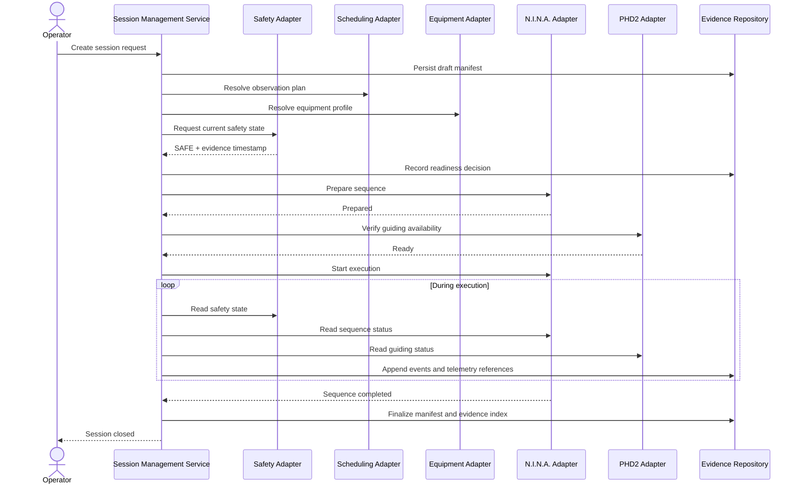

# SOL-OSM-001 — Runtime Architecture

## 1. Purpose

This document describes how the solution behaves during an observation session, from preparation through closure or recovery.

## 2. Runtime participants

- **Operator Interface** — initiates, supervises and, when authorized, overrides a session.
- **Session Management Service** — owns the session lifecycle and manifest.
- **Session Orchestrator** — coordinates checks and execution steps.
- **Safety Adapter** — reads authoritative safety state; never replaces the safety controller.
- **Scheduling Adapter** — receives or validates an observation plan.
- **Equipment Adapter** — resolves the required equipment configuration.
- **Target Adapter** — resolves target metadata and constraints.
- **N.I.N.A. Adapter** — starts, monitors and stops imaging sequences.
- **PHD2 Adapter** — monitors guiding state.
- **CPWI/ASCOM Adapter** — observes mount and device state.
- **Evidence Repository** — persists commands, transitions, events and artefacts.

## 3. Happy-path sequence

## 4. Runtime invariants

1. Every state transition is persisted with timestamp, reason and actor.
2. A session may enter `EXECUTING` only after readiness checks pass.
3. `UNSAFE` always has precedence over scheduling and imaging objectives.
4. Recovery does not erase the original failure event.
5. Closure produces an immutable evidence summary.
6. Manual actions are recorded with operator identity and rationale.

## 5. Control loops

### 5.1 Safety loop

The orchestrator periodically reads the authoritative safety state. A transition to `UNSAFE` triggers the configured safe-response policy without waiting for operator confirmation.

### 5.2 Execution loop

The orchestrator monitors N.I.N.A. sequence status, guiding health, mount state, camera state and required storage availability.

### 5.3 Evidence loop

All relevant commands, responses, state changes and exceptions are appended to the session evidence set. High-volume telemetry may be referenced rather than copied into the manifest.

## 6. Degraded operation

Degraded operation is allowed only when explicitly defined by policy. Examples include continuing without remote synchronization while local storage remains healthy. Degraded operation must never weaken the safety boundary.
