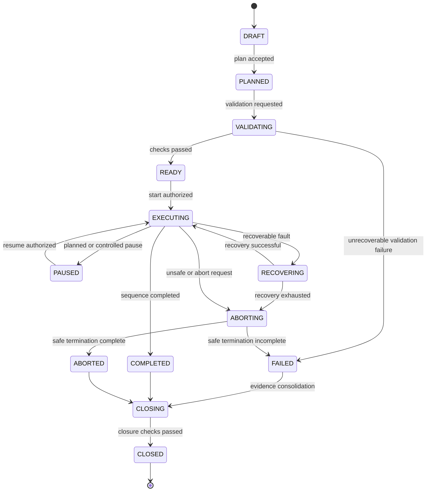

# SOL-OSM-001 — Session State Model

## 1. Canonical states

| State | Meaning |
|---|---|
| `DRAFT` | Session exists but has not entered readiness evaluation |
| `PLANNED` | Target, schedule and equipment intent are resolved |
| `VALIDATING` | Safety, equipment and operational preconditions are being checked |
| `READY` | All mandatory checks have passed |
| `EXECUTING` | Observation workflow is active |
| `PAUSED` | Execution is temporarily suspended and remains recoverable |
| `RECOVERING` | Automated or operator-assisted recovery is in progress |
| `ABORTING` | Controlled termination and safe actions are in progress |
| `COMPLETED` | Planned execution completed successfully |
| `ABORTED` | Session terminated before successful completion |
| `FAILED` | Session cannot proceed or recover under the active policy |
| `CLOSING` | Evidence, artefacts and final status are being consolidated |
| `CLOSED` | Lifecycle is complete and the evidence package is finalized |

## 2. State diagram



## 3. Transition record

Each transition record contains at least:

```yaml
session_id: DSG-SESSION-YYYYMMDD-NNN
from_state: READY
to_state: EXECUTING
occurred_at: 2026-07-28T21:15:00+02:00
actor_type: system
actor_id: session-orchestrator
reason_code: START_AUTHORIZED
correlation_id: UUID
safety_state: SAFE
evidence_refs: []
```

## 4. Transition guards

| Transition | Mandatory guard |
|---|---|
| `VALIDATING → READY` | All blocking checks passed and safety is `SAFE` |
| `READY → EXECUTING` | Start authorization recorded and execution adapters ready |
| `PAUSED → EXECUTING` | Pause cause cleared and safety remains `SAFE` |
| `RECOVERING → EXECUTING` | Recovery verification passed |
| `ABORTING → ABORTED` | Safe actions completed or accepted fallback reached |
| `CLOSING → CLOSED` | Manifest finalized and mandatory evidence indexed |

## 5. Forbidden transitions

Direct transitions such as `DRAFT → EXECUTING`, `FAILED → EXECUTING`, or `CLOSED → EXECUTING` are forbidden. Re-execution requires a new session or an explicitly governed retry session linked to the original one.
